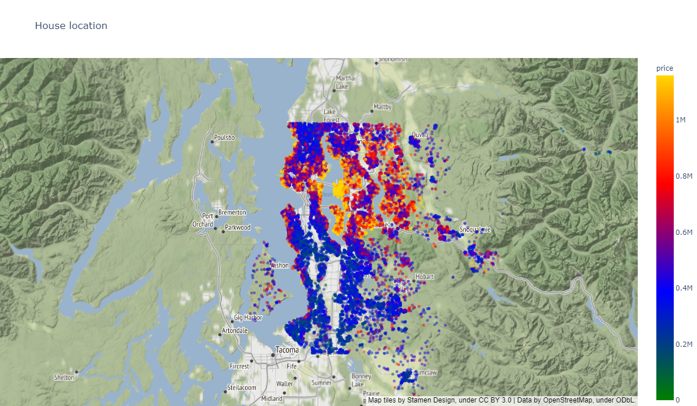
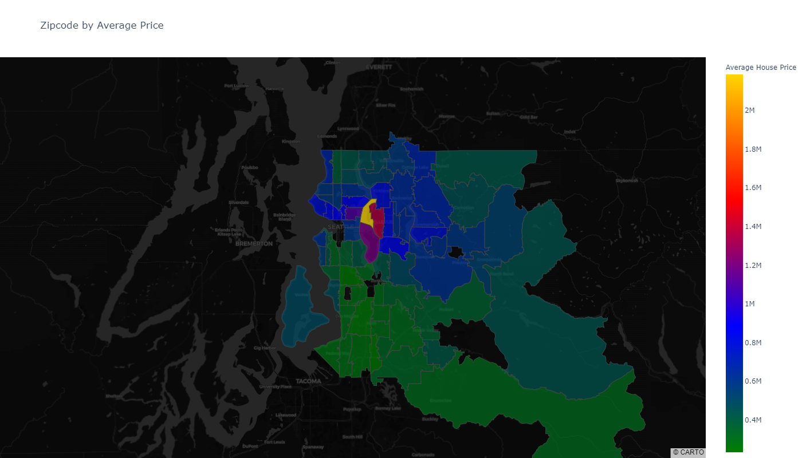

# INTRODUCTION

## Overview

King County is located in the U.S. state of Washington. The population was 2,252,782 in the 2019 census estimate, making it the most populous county in Washington, and the 12th-most populous in the United States. The county seat is Seattle, also the state's most populous city. The county is named to honor civil rights leader Martin Luther King Jr.[[1]](https://en.wikipedia.org/wiki/King_County,_Washington) 

The county sees a USD 700K Median Listing Home Price, USD 431 Median Listing Home Price/Sq Ft, USD 766K Median Sold Home Price, with around 6000 homes listed for sale and 2800 homes for rent.[[2]](https://www.realtor.com/realestateandhomes-search/King-County_WA/overview) Homes in King County, WA sold for 2.19% above asking price on average in March 2021 with a median of 36 days days on market.


In March 2021, King County home prices were up 15.4% compared to last year. There were 3,198 homes sold in March 2021, up from 2,656 last year.[[3]](https://www.redfin.com/county/118/WA/King-County/housing-market).

This makes the county a prime market of real estate, and a paramount candidate for analysis. The namesake of Martin King Luther Jr. has a very lucrative real estate market worth exploring.

## Business problem


     
Source: image generated by author using tableau public, and online gif maker.

King County Residents that want to renovate their home to increase its resale value, but don't know what factors are important for determining a home's value. While focusing on features they can renovate, I shall discuss key factors of a home's price. This factors can be both under their constrain and beyond their control.

Those include:
- How to improve marketability.
- Focus on which aspect of the house.
- What factors to keep in mind deciding budget and required return on investment.

I loosely followed OSEMiN framework for organizing this analysis.

# OBTAIN

Data for this analysis was provided as part of phase two project of [The Flatiron School](https://flatironschool.com/) Full Time Online Data Science program. This a fork of [that](https://github.com/learn-co-curriculum/dsc-phase-2-project). The csv file named `kc_house_data.csv` contains following information in this repository located at `./data/kc_house_data.csv`.

GeoJson file used to get map is soured from [here](https://github.com/OpenDataDE/State-zip-code-GeoJSON/blob/master/wa_washington_zip_codes_geo.min.json) provided by [Open Data Delaware](https://github.com/OpenDataDE/). A copy of that can be found at `./data/wa_washington_zip_codes_geo.min.json'` in this repository.

## Column Names and descriptions for Kings County Data Set

As per the readme file accompanying the dataset.

* **id** - unique identified for a house
* **dateDate** - house was sold
* **pricePrice** -  is prediction target
* **bedroomsNumber** -  of Bedrooms/House
* **bathroomsNumber** -  of bathrooms/bedrooms
* **sqft_livingsquare** -  footage of the home
* **sqft_lotsquare** -  footage of the lot
* **floorsTotal** -  floors (levels) in house
* **waterfront** - House which has a view to a waterfront
* **view** - Has been viewed
* **condition** - How good the condition is ( Overall )
* **grade** - overall grade given to the housing unit, based on King County grading system
* **sqft_above** - square footage of house apart from basement
* **sqft_basement** - square footage of the basement
* **yr_built** - Built Year
* **yr_renovated** - Year when house was renovated
* **zipcode** - zip
* **lat** - Latitude coordinate
* **long** - Longitude coordinate
* **sqft_living15** - The square footage of interior housing living space for the nearest 15 neighbors
* **sqft_lot15** - The square footage of the land lots of the nearest 15 neighbors


Although explanation and data contained in **view** does not make any real life sense. It is very unlikely that so many house is sold without inspection, with keeping in mind that some folks buy houses for investment purpose, still some kind of representative visits and facilitate buying process. All other features are supportive of the explanation given and data contained with some extreme outliers, e.g. one house has 33 bedroom with an disproportionate sqft.

# SCRUB & EXPLORE

Went through the usual data exploration at this step. Checked for null, missing, dtype.

These are the data that I worked with.

    Index(['id', 'date', 'price', 'bedrooms', 'bathrooms', 'sqft_living',
           'sqft_lot', 'floors', 'waterfront', 'view', 'condition', 'grade',
           'sqft_above', 'sqft_basement', 'yr_built', 'yr_renovated', 'zipcode',
           'lat', 'long', 'sqft_living15', 'sqft_lot15'],
          dtype='object')

Shape of the data is (21597, 21)


Then checked for outliers. I seems that there are many.

    
    ____________________________________________________________
    DataFrame Columns Boxplot
    ____________________________________________________________
    


    

## Initial cleaning


 * Dropped duplicates from `id` column
 * Converted `date` to datetime dtype
 * Replaced missing (Nan and "?") rows to 0 in `waterfront`, `view`, `yr_renovated`, `sqft_basement`.
 
 My reasoning for filling with 0 is that, it is relatively safe to assume that the house does not have waterfront, was not renovated and does not have basement. Alternatively I could have simply dropped those from the dataset. Filling with mean or mode has the same drawback as filling with 0 because of the pattern of missing values, so I filled in with 0.
 
 Then I dropped a row where bedroom was 33. It is clearly a mistake in data entry, as it does not match with the sqft of that house. Could have filled that to 3, but did not do so as the data loss is negligible. 


## Features added
### Price per sqft

Ratio of price of each house over total sqft of that.


### Neighborhood

Created a boolean feature to check that Total sqft of a house is within 40% to 60% range of average of total sqft of surrounding 15 house to detect unusual house in the neighborhood. This is a check for unusual homes.


### Is Renovated

Out of 21419 values, 20679 are empty while only 740 rows containing year renovated. This is not usefull for the model. So this feature is converted to a boolean, where 1 means it is renovated and 0 means it not renovated.
    


## Categorical and Numerical  features

### Identifying
based on information from the readme file attached to the dataset.
```python
# House identifier
unique_feat_df = ['id']

# Catagorical features
categorical_feat_df = ['waterfront', 'view', 'condition', 'grade', 'is_renovated']

# Numeric features
numerical_continuous_feat_df = [
    'price', 'sqft_living', 'sqft_lot', 'sqft_above', 'sqft_basement',
    'sqft_living15', 'sqft_lot15', 'price_per_sqft',
    'distance_from_downtown_mile', 'total_sqft_larger_than_neighbours',
    'price_per_sqft']

numerical_discrete_feat_df = ['bedrooms', 'bathrooms', 'floors']

# Timing features
time_feat_df = ['date', 'yr_built', 'yr_renovated']

# Location feat
location_feat_df = ['lat', 'long', 'zipcode']
```


### Dropping

In the Dataframe for initial model `id`, `date`, `yr_renovated`, and `view` is not included. My reasoning for this is following:
- `id`: This is the identifier column.
- `date`: Sale date is not important input for now as I am not capturing seasonality of value for this analysis.
- `yr_renovated`: Already converted to boolean column.
- `view`: Not sure about this feature what it really means as not much information is provided. This can also be a categorical or numeric feature.

## Feature relationships

### Feature correlation and multicollinearity 


### Heatmap


Here is a heat map of correlation.

    

    


Only sqft features are collinear in nature. This is expected. and has a relationship with grade. Leaving it as it is right now.

### View - what is it?

    

    


Now I tried to make sense of `"view"`. It seems like it detects the aesthetic quality of the house. Not sure if it is something that a owner can manipulate, e.g. architectural design or landscaping and decoration; or its is natural, e.g. close to a park or view from window.

Higher rated house has the greatest average price. This trend is very clear.

It seems that houses closer to the downtown has a higher price per sqft but lower view as the city landscape is not pristine but proximity to business center makes them desirable. But at the next category price drops as distance increases, people are not shelling coins for sub-par property. When the distance is high means we are out of downtown with less congested area where view is better, thus increase in price. Then at the last one we are at the suburbs, where price sees a drop because of distance.

This feature is still sufficiently ambiguous to present to the public, I might be interpreting this from a myopic view and got entirely wrong. 


### Paired Feature exploration

### Price VS Year Built

    

    


Hoses built in the 40's to 60's have good value. A weird situation for the beginning of 70's, maybe related to a quirk of the dataset or energy crisis of that time, more domain research is needed to comment on that. High sale frequency in the early 00's to a dip in 2008 because of the global financial crisis because of subprime mortgage situation. House prices was in a bubble that created the financial crisis. This data also supports that. This data of house price and sale coincides with all financial crisis. But across the board house price is stable. Have to look into sale date to make any further comment.

### Price VS Bedroom Count


    

    


Increased bedroom count has a diminishing return after a certain thresh hold, which is 5 after that . Although more house with more bedroom has higher average sale price, this is because they are usually a larger property. I could bin house size and go down that path to pin point that, but not choosing not to for the sake of time constraint.


### Location

#### House Location


    

    


Most expensive houses are centered around downtown Seattle.


#### Average Price by Zipcode


    


Not all zipcodes have the same house price.

### Outlier Removal
Then I decided to check the performance of IQR based and Z score based outlier removal. Based on the shape of result it seemed that IQR based removal is more appropriate here.

From the chart potential candidate for formula based outlier removal are:
- price
- bathrooms
- bathrooms
- sqft_living
- sqft_lot
- floors
- condition
- sqft_above
- sqft_basement

And for manual outlier removal: 
- distance_from_downtown_mile


One sample of that process

    


Across the board outlier removal by using IQR is the winner. Stats for that is:


    Dropping data
    ________________________________________________________________________________________________________________________________________________________________
    Price
       Data dropped: 1151
       Data loss : 5.3737%
    Bathrooms
       Data dropped: 99
       Data loss : 0.4885%
    Bathrooms
       Data dropped: 89
       Data loss : 0.4448%
    Sqft_living
       Data dropped: 265
       Data loss : 1.3255%
    Sqft_lot
       Data dropped: 2168
       Data loss : 10.8438%
    Floors
       Data dropped: 0
       Data loss : 0.0%
    Condition
       Data dropped: 27
       Data loss : 0.135%
    Sqft_above
       Data dropped: 447
       Data loss : 2.2358%
    Sqft_basement
       Data dropped: 523
       Data loss : 2.6159%
    ________________________________________________________________________________________________________________________________________________________________
    
    New utlier removed dataset length: 19993
    Old dataset length: 21419
    Total data loss: 6.89%
    

There are few extremely big values in distance_from_downtown feature, which were removed. Thresh hold for this is that houses with distance of more than 40 miles were dropped. There were 18 outliers. So the final dataset size is 19975.

## Ordinary Least Squares
Formula that I used for regression.


```python
def OLS_sm(df,
           dependant_var='price',
           numeric_features=[],
           categorical_features=[],
           verbose=False,
           show_summary=True,
           show_plots=True,
           target_is_dollar=True):
    """
    ### Uses formula based statsmodels regression for OLS. ###
    
    Displays a statsmodels.iolib.summary.Summary object containing summary of OLS analysis. 
    Returns a statsmodels.regression.linear_model.RegressionResultsWrapper which can be used to access other options available.

    Parameters:
    ===========
        df = pandas.DataFrame; no default. 
                Input dataset to use for OLS.
        dependant_var = str; default: 'price'. 
                Dependent variable.
        numeric_features = list; default = []. 
                Identify numeric features.
        categorical_features = list; default = []. 
                Identify categorical features.
        verbose = boolean; default: False. 
                Shows some formula used and drop information.
                    `True` shows information.
                    `False` does not show information.
        show_summary = boolean; default: False. 
                Shows summary report.
                    `True` shows information.
                    `False` does not show information.
        show_plots = boolean; default: True. 
                Shows summary and Homoscedasticity information.
                    `True` shows information.
                    `False` does not show information.
        target_is_dollar = boolean; default: True. 
                Modify chart axis label.
                    `True` shows information.
                    `False` does not show information.    

    """
    cate = ' + '.join([f'C({x})' for x in categorical_features])
    nume = ' + '.join([f'{x}' for x in numeric_features])
    if len(cate)==0:
        formula = f'{dependant_var} ~ {nume}'
    else:
        formula = f'{dependant_var} ~ {nume} + {cate}'
    print('Formula for the OLS model: ', formula)
    # OLS regressor
    multiple_regression = smf.ols(formula=formula, data=df).fit()

    if verbose:
        show_summary = True
        show_plots = True

    if show_summary:
        display(multiple_regression.summary())
    if show_plots:
        # plotting
        # plot 1
        fig, (ax1,
              ax2) = plt.subplots(ncols=2,
                                  figsize=(10, 5),
                                  gridspec_kw={'width_ratios': [0.6, 0.4]})
        sm.qqplot(multiple_regression.resid,
                  dist=stats.norm,
                  line='45',
                  fit=True,
                  ax=ax1)
        ax1.set_title('Q-Q Plot', fontdict={"size": 15})
        # plot 2
        # uses The predicted values for the original (unwhitened) design.
        ax2.scatter(x=multiple_regression.fittedvalues, 
                    y=multiple_regression.resid,
                    s=4,
                    color='gold')
        if target_is_dollar:
            ax2.yaxis.set_major_formatter(format_number)
        ax2.set(xlabel='Predicted', ylabel='Residuals')
        ax2.axhline(y=0, c='r', lw=4, ls='--')
        ax2.set_title('Predicted VS Residuals', fontdict={"size": 15})
        plt.suptitle('Visual Check of Residuals for Homoscedasticity',
                     ha='center',
                     va='bottom',
                     fontdict={"size": 25})
        plt.tight_layout()
    if verbose == False and show_summary == False and show_plots == True:
        print('r_sq:', round(multiple_regression.rsquared, 4))
    return multiple_regression
```

## Lets take a quick look at a regression.

 ## With outlier


    Formula for the OLS model:  price ~ bedrooms + bathrooms + sqft_living + sqft_lot + floors + sqft_above + sqft_basement + yr_built + lat + long + sqft_living15 + sqft_lot15 + distance_from_downtown_mile + price_per_sqft + C(waterfront) + C(condition) + C(grade) + C(is_renovated) + C(zipcode) + C(total_sqft_larger_than_neighbours)
    


<table class="simpletable">
<caption>OLS Regression Results</caption>
<tr>
  <th>Dep. Variable:</th>          <td>price</td>      <th>  R-squared:         </th>  <td>   0.852</td>  
</tr>
<tr>
  <th>Model:</th>                   <td>OLS</td>       <th>  Adj. R-squared:    </th>  <td>   0.851</td>  
</tr>
<tr>
  <th>Method:</th>             <td>Least Squares</td>  <th>  F-statistic:       </th>  <td>   1223.</td>  
</tr>
<tr>
  <th>Date:</th>             <td>Mon, 19 Apr 2021</td> <th>  Prob (F-statistic):</th>   <td>  0.00</td>   
</tr>
<tr>
  <th>Time:</th>                 <td>09:42:02</td>     <th>  Log-Likelihood:    </th> <td>-2.8446e+05</td>
</tr>
<tr>
  <th>No. Observations:</th>      <td> 21419</td>      <th>  AIC:               </th>  <td>5.691e+05</td> 
</tr>
<tr>
  <th>Df Residuals:</th>          <td> 21318</td>      <th>  BIC:               </th>  <td>5.699e+05</td> 
</tr>
<tr>
  <th>Df Model:</th>              <td>   100</td>      <th>                     </th>      <td> </td>     
</tr>
<tr>
  <th>Covariance Type:</th>      <td>nonrobust</td>    <th>                     </th>      <td> </td>     
</tr>
</table>
<table class="simpletable">
<tr>
                      <td></td>                         <th>coef</th>     <th>std err</th>      <th>t</th>      <th>P>|t|</th>  <th>[0.025</th>    <th>0.975]</th>  
</tr>
<tr>
  <th>Intercept</th>                                 <td> 1.127e+07</td> <td> 7.74e+06</td> <td>    1.456</td> <td> 0.145</td> <td>-3.91e+06</td> <td> 2.65e+07</td>
</tr>
<tr>
  <th>C(waterfront)[T.1]</th>                        <td> 7.249e+05</td> <td> 1.24e+04</td> <td>   58.616</td> <td> 0.000</td> <td> 7.01e+05</td> <td> 7.49e+05</td>
</tr>
<tr>
  <th>C(condition)[T.2]</th>                         <td> 5.079e+04</td> <td> 2.92e+04</td> <td>    1.738</td> <td> 0.082</td> <td>-6499.167</td> <td> 1.08e+05</td>
</tr>
<tr>
  <th>C(condition)[T.3]</th>                         <td> 5.362e+04</td> <td> 2.72e+04</td> <td>    1.974</td> <td> 0.048</td> <td>  373.573</td> <td> 1.07e+05</td>
</tr>
<tr>
  <th>C(condition)[T.4]</th>                         <td> 7.731e+04</td> <td> 2.72e+04</td> <td>    2.844</td> <td> 0.004</td> <td>  2.4e+04</td> <td> 1.31e+05</td>
</tr>
<tr>
  <th>C(condition)[T.5]</th>                         <td> 1.037e+05</td> <td> 2.74e+04</td> <td>    3.790</td> <td> 0.000</td> <td> 5.01e+04</td> <td> 1.57e+05</td>
</tr>
<tr>
  <th>C(grade)[T.4]</th>                             <td>-7.859e+04</td> <td> 1.45e+05</td> <td>   -0.542</td> <td> 0.588</td> <td>-3.63e+05</td> <td> 2.06e+05</td>
</tr>
<tr>
  <th>C(grade)[T.5]</th>                             <td>-1.269e+05</td> <td> 1.43e+05</td> <td>   -0.889</td> <td> 0.374</td> <td>-4.07e+05</td> <td> 1.53e+05</td>
</tr>
<tr>
  <th>C(grade)[T.6]</th>                             <td>-1.265e+05</td> <td> 1.42e+05</td> <td>   -0.888</td> <td> 0.374</td> <td>-4.06e+05</td> <td> 1.53e+05</td>
</tr>
<tr>
  <th>C(grade)[T.7]</th>                             <td>-1.286e+05</td> <td> 1.42e+05</td> <td>   -0.903</td> <td> 0.367</td> <td>-4.08e+05</td> <td> 1.51e+05</td>
</tr>
<tr>
  <th>C(grade)[T.8]</th>                             <td>-1.179e+05</td> <td> 1.43e+05</td> <td>   -0.827</td> <td> 0.408</td> <td>-3.97e+05</td> <td> 1.61e+05</td>
</tr>
<tr>
  <th>C(grade)[T.9]</th>                             <td> -5.76e+04</td> <td> 1.43e+05</td> <td>   -0.404</td> <td> 0.686</td> <td>-3.37e+05</td> <td> 2.22e+05</td>
</tr>
<tr>
  <th>C(grade)[T.10]</th>                            <td> 5.773e+04</td> <td> 1.43e+05</td> <td>    0.405</td> <td> 0.686</td> <td>-2.22e+05</td> <td> 3.37e+05</td>
</tr>
<tr>
  <th>C(grade)[T.11]</th>                            <td> 2.338e+05</td> <td> 1.43e+05</td> <td>    1.636</td> <td> 0.102</td> <td>-4.62e+04</td> <td> 5.14e+05</td>
</tr>
<tr>
  <th>C(grade)[T.12]</th>                            <td> 6.467e+05</td> <td> 1.44e+05</td> <td>    4.502</td> <td> 0.000</td> <td> 3.65e+05</td> <td> 9.28e+05</td>
</tr>
<tr>
  <th>C(grade)[T.13]</th>                            <td> 1.682e+06</td> <td> 1.49e+05</td> <td>   11.323</td> <td> 0.000</td> <td> 1.39e+06</td> <td> 1.97e+06</td>
</tr>
<tr>
  <th>C(is_renovated)[T.1]</th>                      <td> 4.426e+04</td> <td> 5712.285</td> <td>    7.748</td> <td> 0.000</td> <td> 3.31e+04</td> <td> 5.55e+04</td>
</tr>
<tr>
  <th>C(zipcode)[T.98002]</th>                       <td>-1.887e+04</td> <td>  1.3e+04</td> <td>   -1.455</td> <td> 0.146</td> <td>-4.43e+04</td> <td> 6548.366</td>
</tr>
<tr>
  <th>C(zipcode)[T.98003]</th>                       <td>-1.257e+04</td> <td> 1.16e+04</td> <td>   -1.088</td> <td> 0.277</td> <td>-3.52e+04</td> <td> 1.01e+04</td>
</tr>
<tr>
  <th>C(zipcode)[T.98004]</th>                       <td> 4.921e+05</td> <td> 2.41e+04</td> <td>   20.409</td> <td> 0.000</td> <td> 4.45e+05</td> <td> 5.39e+05</td>
</tr>
<tr>
  <th>C(zipcode)[T.98005]</th>                       <td> 1.299e+05</td> <td> 2.52e+04</td> <td>    5.153</td> <td> 0.000</td> <td> 8.05e+04</td> <td> 1.79e+05</td>
</tr>
<tr>
  <th>C(zipcode)[T.98006]</th>                       <td> 9.943e+04</td> <td> 2.18e+04</td> <td>    4.553</td> <td> 0.000</td> <td> 5.66e+04</td> <td> 1.42e+05</td>
</tr>
<tr>
  <th>C(zipcode)[T.98007]</th>                       <td> 7.988e+04</td> <td> 2.58e+04</td> <td>    3.095</td> <td> 0.002</td> <td> 2.93e+04</td> <td>  1.3e+05</td>
</tr>
<tr>
  <th>C(zipcode)[T.98008]</th>                       <td> 9.921e+04</td> <td> 2.46e+04</td> <td>    4.034</td> <td> 0.000</td> <td>  5.1e+04</td> <td> 1.47e+05</td>
</tr>
<tr>
  <th>C(zipcode)[T.98010]</th>                       <td> 3.731e+04</td> <td> 2.04e+04</td> <td>    1.827</td> <td> 0.068</td> <td>-2726.394</td> <td> 7.74e+04</td>
</tr>
<tr>
  <th>C(zipcode)[T.98011]</th>                       <td> 1.354e+04</td> <td> 2.87e+04</td> <td>    0.472</td> <td> 0.637</td> <td>-4.27e+04</td> <td> 6.97e+04</td>
</tr>
<tr>
  <th>C(zipcode)[T.98014]</th>                       <td> 2.911e+04</td> <td>  3.2e+04</td> <td>    0.910</td> <td> 0.363</td> <td>-3.36e+04</td> <td> 9.18e+04</td>
</tr>
<tr>
  <th>C(zipcode)[T.98019]</th>                       <td> 1.694e+04</td> <td> 3.12e+04</td> <td>    0.542</td> <td> 0.588</td> <td>-4.43e+04</td> <td> 7.82e+04</td>
</tr>
<tr>
  <th>C(zipcode)[T.98022]</th>                       <td> 1.379e+04</td> <td> 1.71e+04</td> <td>    0.809</td> <td> 0.419</td> <td>-1.96e+04</td> <td> 4.72e+04</td>
</tr>
<tr>
  <th>C(zipcode)[T.98023]</th>                       <td>-3.072e+04</td> <td> 1.11e+04</td> <td>   -2.760</td> <td> 0.006</td> <td>-5.25e+04</td> <td>-8905.613</td>
</tr>
<tr>
  <th>C(zipcode)[T.98024]</th>                       <td> 7.164e+04</td> <td> 2.92e+04</td> <td>    2.456</td> <td> 0.014</td> <td> 1.45e+04</td> <td> 1.29e+05</td>
</tr>
<tr>
  <th>C(zipcode)[T.98027]</th>                       <td> 2.128e+04</td> <td> 2.16e+04</td> <td>    0.984</td> <td> 0.325</td> <td>-2.11e+04</td> <td> 6.36e+04</td>
</tr>
<tr>
  <th>C(zipcode)[T.98028]</th>                       <td> 1.978e+04</td> <td> 2.78e+04</td> <td>    0.712</td> <td> 0.476</td> <td>-3.47e+04</td> <td> 7.42e+04</td>
</tr>
<tr>
  <th>C(zipcode)[T.98029]</th>                       <td> 5.437e+04</td> <td> 2.39e+04</td> <td>    2.271</td> <td> 0.023</td> <td> 7453.207</td> <td> 1.01e+05</td>
</tr>
<tr>
  <th>C(zipcode)[T.98030]</th>                       <td>-2.574e+04</td> <td> 1.36e+04</td> <td>   -1.886</td> <td> 0.059</td> <td>-5.25e+04</td> <td> 1010.878</td>
</tr>
<tr>
  <th>C(zipcode)[T.98031]</th>                       <td>-3.052e+04</td> <td> 1.48e+04</td> <td>   -2.058</td> <td> 0.040</td> <td>-5.96e+04</td> <td>-1449.852</td>
</tr>
<tr>
  <th>C(zipcode)[T.98032]</th>                       <td>-3.214e+04</td> <td> 1.56e+04</td> <td>   -2.055</td> <td> 0.040</td> <td>-6.28e+04</td> <td>-1489.474</td>
</tr>
<tr>
  <th>C(zipcode)[T.98033]</th>                       <td>  1.71e+05</td> <td> 2.54e+04</td> <td>    6.735</td> <td> 0.000</td> <td> 1.21e+05</td> <td> 2.21e+05</td>
</tr>
<tr>
  <th>C(zipcode)[T.98034]</th>                       <td> 6.187e+04</td> <td> 2.62e+04</td> <td>    2.364</td> <td> 0.018</td> <td> 1.06e+04</td> <td> 1.13e+05</td>
</tr>
<tr>
  <th>C(zipcode)[T.98038]</th>                       <td>-2658.2993</td> <td> 1.58e+04</td> <td>   -0.168</td> <td> 0.867</td> <td>-3.37e+04</td> <td> 2.84e+04</td>
</tr>
<tr>
  <th>C(zipcode)[T.98039]</th>                       <td>  9.28e+05</td> <td> 3.08e+04</td> <td>   30.086</td> <td> 0.000</td> <td> 8.68e+05</td> <td> 9.88e+05</td>
</tr>
<tr>
  <th>C(zipcode)[T.98040]</th>                       <td> 3.096e+05</td> <td> 2.22e+04</td> <td>   13.932</td> <td> 0.000</td> <td> 2.66e+05</td> <td> 3.53e+05</td>
</tr>
<tr>
  <th>C(zipcode)[T.98042]</th>                       <td>-2.493e+04</td> <td> 1.36e+04</td> <td>   -1.840</td> <td> 0.066</td> <td>-5.15e+04</td> <td> 1631.556</td>
</tr>
<tr>
  <th>C(zipcode)[T.98045]</th>                       <td> 6.929e+04</td> <td> 2.75e+04</td> <td>    2.521</td> <td> 0.012</td> <td> 1.54e+04</td> <td> 1.23e+05</td>
</tr>
<tr>
  <th>C(zipcode)[T.98052]</th>                       <td> 7.832e+04</td> <td> 2.57e+04</td> <td>    3.043</td> <td> 0.002</td> <td> 2.79e+04</td> <td> 1.29e+05</td>
</tr>
<tr>
  <th>C(zipcode)[T.98053]</th>                       <td> 7.056e+04</td> <td> 2.72e+04</td> <td>    2.595</td> <td> 0.009</td> <td> 1.73e+04</td> <td> 1.24e+05</td>
</tr>
<tr>
  <th>C(zipcode)[T.98055]</th>                       <td>-4.272e+04</td> <td> 1.73e+04</td> <td>   -2.472</td> <td> 0.013</td> <td>-7.66e+04</td> <td>-8852.392</td>
</tr>
<tr>
  <th>C(zipcode)[T.98056]</th>                       <td>-1.564e+04</td> <td> 1.95e+04</td> <td>   -0.803</td> <td> 0.422</td> <td>-5.38e+04</td> <td> 2.25e+04</td>
</tr>
<tr>
  <th>C(zipcode)[T.98058]</th>                       <td>-3.857e+04</td> <td> 1.66e+04</td> <td>   -2.324</td> <td> 0.020</td> <td>-7.11e+04</td> <td>-6033.237</td>
</tr>
<tr>
  <th>C(zipcode)[T.98059]</th>                       <td>-2.291e+04</td> <td>  1.9e+04</td> <td>   -1.207</td> <td> 0.227</td> <td>-6.01e+04</td> <td> 1.43e+04</td>
</tr>
<tr>
  <th>C(zipcode)[T.98065]</th>                       <td>-9781.9362</td> <td> 2.59e+04</td> <td>   -0.377</td> <td> 0.706</td> <td>-6.06e+04</td> <td> 4.11e+04</td>
</tr>
<tr>
  <th>C(zipcode)[T.98070]</th>                       <td>  1.48e+04</td> <td> 1.86e+04</td> <td>    0.794</td> <td> 0.427</td> <td>-2.17e+04</td> <td> 5.13e+04</td>
</tr>
<tr>
  <th>C(zipcode)[T.98072]</th>                       <td> 5.974e+04</td> <td> 2.87e+04</td> <td>    2.085</td> <td> 0.037</td> <td> 3581.604</td> <td> 1.16e+05</td>
</tr>
<tr>
  <th>C(zipcode)[T.98074]</th>                       <td> 4.552e+04</td> <td> 2.51e+04</td> <td>    1.813</td> <td> 0.070</td> <td>-3704.279</td> <td> 9.48e+04</td>
</tr>
<tr>
  <th>C(zipcode)[T.98075]</th>                       <td> 3.001e+04</td> <td> 2.45e+04</td> <td>    1.225</td> <td> 0.221</td> <td> -1.8e+04</td> <td>  7.8e+04</td>
</tr>
<tr>
  <th>C(zipcode)[T.98077]</th>                       <td> 2.786e+04</td> <td> 2.99e+04</td> <td>    0.933</td> <td> 0.351</td> <td>-3.07e+04</td> <td> 8.64e+04</td>
</tr>
<tr>
  <th>C(zipcode)[T.98092]</th>                       <td>    -3e+04</td> <td> 1.17e+04</td> <td>   -2.568</td> <td> 0.010</td> <td>-5.29e+04</td> <td>-7097.416</td>
</tr>
<tr>
  <th>C(zipcode)[T.98102]</th>                       <td>  4.63e+04</td> <td> 2.72e+04</td> <td>    1.704</td> <td> 0.088</td> <td>-6948.937</td> <td> 9.96e+04</td>
</tr>
<tr>
  <th>C(zipcode)[T.98103]</th>                       <td> 2.779e+04</td> <td> 2.41e+04</td> <td>    1.155</td> <td> 0.248</td> <td>-1.94e+04</td> <td>  7.5e+04</td>
</tr>
<tr>
  <th>C(zipcode)[T.98105]</th>                       <td> 1.311e+05</td> <td> 2.54e+04</td> <td>    5.158</td> <td> 0.000</td> <td> 8.13e+04</td> <td> 1.81e+05</td>
</tr>
<tr>
  <th>C(zipcode)[T.98106]</th>                       <td>-1.829e+04</td> <td> 1.92e+04</td> <td>   -0.950</td> <td> 0.342</td> <td> -5.6e+04</td> <td> 1.94e+04</td>
</tr>
<tr>
  <th>C(zipcode)[T.98107]</th>                       <td> 2.342e+04</td> <td> 2.45e+04</td> <td>    0.955</td> <td> 0.339</td> <td>-2.46e+04</td> <td> 7.15e+04</td>
</tr>
<tr>
  <th>C(zipcode)[T.98108]</th>                       <td>-4.317e+04</td> <td>  2.2e+04</td> <td>   -1.964</td> <td> 0.050</td> <td>-8.63e+04</td> <td>  -88.709</td>
</tr>
<tr>
  <th>C(zipcode)[T.98109]</th>                       <td>  9.13e+04</td> <td> 2.65e+04</td> <td>    3.442</td> <td> 0.001</td> <td> 3.93e+04</td> <td> 1.43e+05</td>
</tr>
<tr>
  <th>C(zipcode)[T.98112]</th>                       <td> 2.066e+05</td> <td> 2.49e+04</td> <td>    8.284</td> <td> 0.000</td> <td> 1.58e+05</td> <td> 2.55e+05</td>
</tr>
<tr>
  <th>C(zipcode)[T.98115]</th>                       <td> 7.478e+04</td> <td> 2.45e+04</td> <td>    3.049</td> <td> 0.002</td> <td> 2.67e+04</td> <td> 1.23e+05</td>
</tr>
<tr>
  <th>C(zipcode)[T.98116]</th>                       <td> 5.662e+04</td> <td> 2.07e+04</td> <td>    2.738</td> <td> 0.006</td> <td> 1.61e+04</td> <td> 9.71e+04</td>
</tr>
<tr>
  <th>C(zipcode)[T.98117]</th>                       <td> 5.627e+04</td> <td> 2.41e+04</td> <td>    2.338</td> <td> 0.019</td> <td> 9097.194</td> <td> 1.03e+05</td>
</tr>
<tr>
  <th>C(zipcode)[T.98118]</th>                       <td>-1.781e+04</td> <td> 2.03e+04</td> <td>   -0.877</td> <td> 0.381</td> <td>-5.76e+04</td> <td>  2.2e+04</td>
</tr>
<tr>
  <th>C(zipcode)[T.98119]</th>                       <td> 9.312e+04</td> <td> 2.49e+04</td> <td>    3.746</td> <td> 0.000</td> <td> 4.44e+04</td> <td> 1.42e+05</td>
</tr>
<tr>
  <th>C(zipcode)[T.98122]</th>                       <td> 1843.8601</td> <td> 2.45e+04</td> <td>    0.075</td> <td> 0.940</td> <td>-4.61e+04</td> <td> 4.98e+04</td>
</tr>
<tr>
  <th>C(zipcode)[T.98125]</th>                       <td> 4.806e+04</td> <td> 2.56e+04</td> <td>    1.875</td> <td> 0.061</td> <td>-2184.235</td> <td> 9.83e+04</td>
</tr>
<tr>
  <th>C(zipcode)[T.98126]</th>                       <td> 1.651e+04</td> <td> 1.93e+04</td> <td>    0.855</td> <td> 0.392</td> <td>-2.13e+04</td> <td> 5.43e+04</td>
</tr>
<tr>
  <th>C(zipcode)[T.98133]</th>                       <td> 1.975e+04</td> <td> 2.61e+04</td> <td>    0.758</td> <td> 0.448</td> <td>-3.13e+04</td> <td> 7.08e+04</td>
</tr>
<tr>
  <th>C(zipcode)[T.98136]</th>                       <td> 5.731e+04</td> <td> 1.93e+04</td> <td>    2.973</td> <td> 0.003</td> <td> 1.95e+04</td> <td> 9.51e+04</td>
</tr>
<tr>
  <th>C(zipcode)[T.98144]</th>                       <td> 1490.5305</td> <td> 2.32e+04</td> <td>    0.064</td> <td> 0.949</td> <td>-4.39e+04</td> <td> 4.69e+04</td>
</tr>
<tr>
  <th>C(zipcode)[T.98146]</th>                       <td> 9070.1576</td> <td> 1.75e+04</td> <td>    0.518</td> <td> 0.604</td> <td>-2.52e+04</td> <td> 4.34e+04</td>
</tr>
<tr>
  <th>C(zipcode)[T.98148]</th>                       <td>-7451.0961</td> <td> 2.23e+04</td> <td>   -0.334</td> <td> 0.738</td> <td>-5.11e+04</td> <td> 3.62e+04</td>
</tr>
<tr>
  <th>C(zipcode)[T.98155]</th>                       <td> 3.328e+04</td> <td> 2.71e+04</td> <td>    1.230</td> <td> 0.219</td> <td>-1.98e+04</td> <td> 8.63e+04</td>
</tr>
<tr>
  <th>C(zipcode)[T.98166]</th>                       <td>-1.014e+04</td> <td> 1.54e+04</td> <td>   -0.657</td> <td> 0.511</td> <td>-4.04e+04</td> <td> 2.01e+04</td>
</tr>
<tr>
  <th>C(zipcode)[T.98168]</th>                       <td>-2.913e+04</td> <td> 1.76e+04</td> <td>   -1.654</td> <td> 0.098</td> <td>-6.37e+04</td> <td> 5392.000</td>
</tr>
<tr>
  <th>C(zipcode)[T.98177]</th>                       <td> 9.163e+04</td> <td> 2.71e+04</td> <td>    3.378</td> <td> 0.001</td> <td> 3.85e+04</td> <td> 1.45e+05</td>
</tr>
<tr>
  <th>C(zipcode)[T.98178]</th>                       <td>-6.265e+04</td> <td>  1.9e+04</td> <td>   -3.306</td> <td> 0.001</td> <td>-9.98e+04</td> <td>-2.55e+04</td>
</tr>
<tr>
  <th>C(zipcode)[T.98188]</th>                       <td>-2.976e+04</td> <td> 1.78e+04</td> <td>   -1.674</td> <td> 0.094</td> <td>-6.46e+04</td> <td> 5089.611</td>
</tr>
<tr>
  <th>C(zipcode)[T.98198]</th>                       <td> -2.75e+04</td> <td> 1.27e+04</td> <td>   -2.161</td> <td> 0.031</td> <td>-5.24e+04</td> <td>-2562.458</td>
</tr>
<tr>
  <th>C(zipcode)[T.98199]</th>                       <td> 1.117e+05</td> <td> 2.33e+04</td> <td>    4.798</td> <td> 0.000</td> <td> 6.61e+04</td> <td> 1.57e+05</td>
</tr>
<tr>
  <th>C(total_sqft_larger_than_neighbours)[T.1]</th> <td>-5.859e+04</td> <td> 7541.234</td> <td>   -7.769</td> <td> 0.000</td> <td>-7.34e+04</td> <td>-4.38e+04</td>
</tr>
<tr>
  <th>bedrooms</th>                                  <td>-1.031e+04</td> <td> 1464.808</td> <td>   -7.042</td> <td> 0.000</td> <td>-1.32e+04</td> <td>-7443.555</td>
</tr>
<tr>
  <th>bathrooms</th>                                 <td> 1.702e+04</td> <td> 2359.169</td> <td>    7.216</td> <td> 0.000</td> <td> 1.24e+04</td> <td> 2.16e+04</td>
</tr>
<tr>
  <th>sqft_living</th>                               <td>  115.4763</td> <td>   12.791</td> <td>    9.028</td> <td> 0.000</td> <td>   90.404</td> <td>  140.548</td>
</tr>
<tr>
  <th>sqft_lot</th>                                  <td>    0.4399</td> <td>    0.034</td> <td>   12.839</td> <td> 0.000</td> <td>    0.373</td> <td>    0.507</td>
</tr>
<tr>
  <th>floors</th>                                    <td>-8.434e+04</td> <td> 3003.898</td> <td>  -28.077</td> <td> 0.000</td> <td>-9.02e+04</td> <td>-7.85e+04</td>
</tr>
<tr>
  <th>sqft_above</th>                                <td>   76.9522</td> <td>   12.829</td> <td>    5.998</td> <td> 0.000</td> <td>   51.806</td> <td>  102.098</td>
</tr>
<tr>
  <th>sqft_basement</th>                             <td>   11.2151</td> <td>   12.667</td> <td>    0.885</td> <td> 0.376</td> <td>  -13.612</td> <td>   36.042</td>
</tr>
<tr>
  <th>yr_built</th>                                  <td>-1253.5786</td> <td>   60.323</td> <td>  -20.781</td> <td> 0.000</td> <td>-1371.816</td> <td>-1135.341</td>
</tr>
<tr>
  <th>lat</th>                                       <td> 5.379e+04</td> <td> 5.93e+04</td> <td>    0.907</td> <td> 0.364</td> <td>-6.24e+04</td> <td>  1.7e+05</td>
</tr>
<tr>
  <th>long</th>                                      <td> 9.238e+04</td> <td> 5.53e+04</td> <td>    1.670</td> <td> 0.095</td> <td> -1.6e+04</td> <td> 2.01e+05</td>
</tr>
<tr>
  <th>sqft_living15</th>                             <td>   37.7573</td> <td>    2.549</td> <td>   14.811</td> <td> 0.000</td> <td>   32.761</td> <td>   42.754</td>
</tr>
<tr>
  <th>sqft_lot15</th>                                <td>    0.2575</td> <td>    0.054</td> <td>    4.734</td> <td> 0.000</td> <td>    0.151</td> <td>    0.364</td>
</tr>
<tr>
  <th>distance_from_downtown_mile</th>               <td>-3836.2948</td> <td> 1057.881</td> <td>   -3.626</td> <td> 0.000</td> <td>-5909.822</td> <td>-1762.767</td>
</tr>
<tr>
  <th>price_per_sqft</th>                            <td> 2610.0242</td> <td>   44.511</td> <td>   58.638</td> <td> 0.000</td> <td> 2522.779</td> <td> 2697.269</td>
</tr>
</table>
<table class="simpletable">
<tr>
  <th>Omnibus:</th>       <td>16124.711</td> <th>  Durbin-Watson:     </th>  <td>   1.993</td>  
</tr>
<tr>
  <th>Prob(Omnibus):</th>  <td> 0.000</td>   <th>  Jarque-Bera (JB):  </th> <td>1793971.542</td>
</tr>
<tr>
  <th>Skew:</th>           <td> 2.873</td>   <th>  Prob(JB):          </th>  <td>    0.00</td>  
</tr>
<tr>
  <th>Kurtosis:</th>       <td>47.465</td>   <th>  Cond. No.          </th>  <td>4.05e+08</td>  
</tr>
</table><br/><br/>Notes:<br/>[1] Standard Errors assume that the covariance matrix of the errors is correctly specified.<br/>[2] The condition number is large, 4.05e+08. This might indicate that there are<br/>strong multicollinearity or other numerical problems.


    

    


## And without outliers.


    Formula for the OLS model:  price ~ bedrooms + bathrooms + sqft_living + sqft_lot + floors + sqft_above + sqft_basement + yr_built + lat + long + sqft_living15 + sqft_lot15 + distance_from_downtown_mile + price_per_sqft + C(waterfront) + C(condition) + C(grade) + C(is_renovated) + C(zipcode) + C(total_sqft_larger_than_neighbours)
    


<table class="simpletable">
<caption>OLS Regression Results</caption>
<tr>
  <th>Dep. Variable:</th>          <td>price</td>      <th>  R-squared:         </th>  <td>   0.848</td>  
</tr>
<tr>
  <th>Model:</th>                   <td>OLS</td>       <th>  Adj. R-squared:    </th>  <td>   0.847</td>  
</tr>
<tr>
  <th>Method:</th>             <td>Least Squares</td>  <th>  F-statistic:       </th>  <td>   1122.</td>  
</tr>
<tr>
  <th>Date:</th>             <td>Mon, 19 Apr 2021</td> <th>  Prob (F-statistic):</th>   <td>  0.00</td>   
</tr>
<tr>
  <th>Time:</th>                 <td>09:42:03</td>     <th>  Log-Likelihood:    </th> <td>-2.5306e+05</td>
</tr>
<tr>
  <th>No. Observations:</th>      <td> 19975</td>      <th>  AIC:               </th>  <td>5.063e+05</td> 
</tr>
<tr>
  <th>Df Residuals:</th>          <td> 19875</td>      <th>  BIC:               </th>  <td>5.071e+05</td> 
</tr>
<tr>
  <th>Df Model:</th>              <td>    99</td>      <th>                     </th>      <td> </td>     
</tr>
<tr>
  <th>Covariance Type:</th>      <td>nonrobust</td>    <th>                     </th>      <td> </td>     
</tr>
</table>
<table class="simpletable">
<tr>
                      <td></td>                         <th>coef</th>     <th>std err</th>      <th>t</th>      <th>P>|t|</th>  <th>[0.025</th>    <th>0.975]</th>  
</tr>
<tr>
  <th>Intercept</th>                                 <td> 3.135e+07</td> <td> 4.55e+06</td> <td>    6.897</td> <td> 0.000</td> <td> 2.24e+07</td> <td> 4.03e+07</td>
</tr>
<tr>
  <th>C(waterfront)[T.1]</th>                        <td>  2.45e+05</td> <td> 1.14e+04</td> <td>   21.542</td> <td> 0.000</td> <td> 2.23e+05</td> <td> 2.67e+05</td>
</tr>
<tr>
  <th>C(condition)[T.2]</th>                         <td> 5.125e+04</td> <td> 1.61e+04</td> <td>    3.178</td> <td> 0.001</td> <td> 1.96e+04</td> <td> 8.29e+04</td>
</tr>
<tr>
  <th>C(condition)[T.3]</th>                         <td> 8.052e+04</td> <td>  1.5e+04</td> <td>    5.363</td> <td> 0.000</td> <td> 5.11e+04</td> <td>  1.1e+05</td>
</tr>
<tr>
  <th>C(condition)[T.4]</th>                         <td>  9.95e+04</td> <td>  1.5e+04</td> <td>    6.622</td> <td> 0.000</td> <td> 7.01e+04</td> <td> 1.29e+05</td>
</tr>
<tr>
  <th>C(condition)[T.5]</th>                         <td> 1.225e+05</td> <td> 1.51e+04</td> <td>    8.097</td> <td> 0.000</td> <td> 9.28e+04</td> <td> 1.52e+05</td>
</tr>
<tr>
  <th>C(grade)[T.4]</th>                             <td>-9.869e+04</td> <td> 7.87e+04</td> <td>   -1.254</td> <td> 0.210</td> <td>-2.53e+05</td> <td> 5.55e+04</td>
</tr>
<tr>
  <th>C(grade)[T.5]</th>                             <td>-1.221e+05</td> <td> 7.74e+04</td> <td>   -1.577</td> <td> 0.115</td> <td>-2.74e+05</td> <td> 2.97e+04</td>
</tr>
<tr>
  <th>C(grade)[T.6]</th>                             <td>-1.103e+05</td> <td> 7.73e+04</td> <td>   -1.427</td> <td> 0.153</td> <td>-2.62e+05</td> <td> 4.12e+04</td>
</tr>
<tr>
  <th>C(grade)[T.7]</th>                             <td>-8.392e+04</td> <td> 7.73e+04</td> <td>   -1.086</td> <td> 0.277</td> <td>-2.35e+05</td> <td> 6.75e+04</td>
</tr>
<tr>
  <th>C(grade)[T.8]</th>                             <td>-4.933e+04</td> <td> 7.73e+04</td> <td>   -0.638</td> <td> 0.523</td> <td>-2.01e+05</td> <td> 1.02e+05</td>
</tr>
<tr>
  <th>C(grade)[T.9]</th>                             <td> 9195.2162</td> <td> 7.73e+04</td> <td>    0.119</td> <td> 0.905</td> <td>-1.42e+05</td> <td> 1.61e+05</td>
</tr>
<tr>
  <th>C(grade)[T.10]</th>                            <td> 4.201e+04</td> <td> 7.74e+04</td> <td>    0.543</td> <td> 0.587</td> <td> -1.1e+05</td> <td> 1.94e+05</td>
</tr>
<tr>
  <th>C(grade)[T.11]</th>                            <td> 7.426e+04</td> <td> 7.78e+04</td> <td>    0.954</td> <td> 0.340</td> <td>-7.82e+04</td> <td> 2.27e+05</td>
</tr>
<tr>
  <th>C(grade)[T.12]</th>                            <td>-5.505e+04</td> <td> 8.94e+04</td> <td>   -0.616</td> <td> 0.538</td> <td> -2.3e+05</td> <td>  1.2e+05</td>
</tr>
<tr>
  <th>C(is_renovated)[T.1]</th>                      <td> 2.685e+04</td> <td> 3405.891</td> <td>    7.882</td> <td> 0.000</td> <td> 2.02e+04</td> <td> 3.35e+04</td>
</tr>
<tr>
  <th>C(zipcode)[T.98002]</th>                       <td>-1.687e+04</td> <td> 7102.867</td> <td>   -2.376</td> <td> 0.018</td> <td>-3.08e+04</td> <td>-2950.727</td>
</tr>
<tr>
  <th>C(zipcode)[T.98003]</th>                       <td> -754.3807</td> <td> 6299.457</td> <td>   -0.120</td> <td> 0.905</td> <td>-1.31e+04</td> <td> 1.16e+04</td>
</tr>
<tr>
  <th>C(zipcode)[T.98004]</th>                       <td> 2.966e+05</td> <td> 1.41e+04</td> <td>   20.997</td> <td> 0.000</td> <td> 2.69e+05</td> <td> 3.24e+05</td>
</tr>
<tr>
  <th>C(zipcode)[T.98005]</th>                       <td> 1.635e+05</td> <td> 1.41e+04</td> <td>   11.612</td> <td> 0.000</td> <td> 1.36e+05</td> <td> 1.91e+05</td>
</tr>
<tr>
  <th>C(zipcode)[T.98006]</th>                       <td> 1.189e+05</td> <td> 1.23e+04</td> <td>    9.687</td> <td> 0.000</td> <td> 9.49e+04</td> <td> 1.43e+05</td>
</tr>
<tr>
  <th>C(zipcode)[T.98007]</th>                       <td>   9.2e+04</td> <td> 1.44e+04</td> <td>    6.383</td> <td> 0.000</td> <td> 6.37e+04</td> <td>  1.2e+05</td>
</tr>
<tr>
  <th>C(zipcode)[T.98008]</th>                       <td> 9.018e+04</td> <td> 1.39e+04</td> <td>    6.498</td> <td> 0.000</td> <td>  6.3e+04</td> <td> 1.17e+05</td>
</tr>
<tr>
  <th>C(zipcode)[T.98010]</th>                       <td> 3.541e+04</td> <td>  1.2e+04</td> <td>    2.953</td> <td> 0.003</td> <td> 1.19e+04</td> <td> 5.89e+04</td>
</tr>
<tr>
  <th>C(zipcode)[T.98011]</th>                       <td> 4.075e+04</td> <td> 1.62e+04</td> <td>    2.521</td> <td> 0.012</td> <td> 9066.545</td> <td> 7.24e+04</td>
</tr>
<tr>
  <th>C(zipcode)[T.98014]</th>                       <td> 1.334e+04</td> <td> 1.85e+04</td> <td>    0.719</td> <td> 0.472</td> <td> -2.3e+04</td> <td> 4.97e+04</td>
</tr>
<tr>
  <th>C(zipcode)[T.98019]</th>                       <td> 7701.9085</td> <td> 1.86e+04</td> <td>    0.414</td> <td> 0.679</td> <td>-2.88e+04</td> <td> 4.42e+04</td>
</tr>
<tr>
  <th>C(zipcode)[T.98022]</th>                       <td> 5753.5045</td> <td> 1.04e+04</td> <td>    0.552</td> <td> 0.581</td> <td>-1.47e+04</td> <td> 2.62e+04</td>
</tr>
<tr>
  <th>C(zipcode)[T.98023]</th>                       <td>-4810.7727</td> <td> 6213.735</td> <td>   -0.774</td> <td> 0.439</td> <td> -1.7e+04</td> <td> 7368.666</td>
</tr>
<tr>
  <th>C(zipcode)[T.98024]</th>                       <td> 3.783e+04</td> <td> 1.75e+04</td> <td>    2.157</td> <td> 0.031</td> <td> 3447.655</td> <td> 7.22e+04</td>
</tr>
<tr>
  <th>C(zipcode)[T.98027]</th>                       <td> 5.153e+04</td> <td> 1.25e+04</td> <td>    4.133</td> <td> 0.000</td> <td> 2.71e+04</td> <td>  7.6e+04</td>
</tr>
<tr>
  <th>C(zipcode)[T.98028]</th>                       <td> 4.196e+04</td> <td> 1.56e+04</td> <td>    2.691</td> <td> 0.007</td> <td> 1.14e+04</td> <td> 7.25e+04</td>
</tr>
<tr>
  <th>C(zipcode)[T.98029]</th>                       <td> 7.407e+04</td> <td>  1.4e+04</td> <td>    5.279</td> <td> 0.000</td> <td> 4.66e+04</td> <td> 1.02e+05</td>
</tr>
<tr>
  <th>C(zipcode)[T.98030]</th>                       <td>-3.964e+04</td> <td> 7513.989</td> <td>   -5.275</td> <td> 0.000</td> <td>-5.44e+04</td> <td>-2.49e+04</td>
</tr>
<tr>
  <th>C(zipcode)[T.98031]</th>                       <td>-4.882e+04</td> <td> 8160.577</td> <td>   -5.983</td> <td> 0.000</td> <td>-6.48e+04</td> <td>-3.28e+04</td>
</tr>
<tr>
  <th>C(zipcode)[T.98032]</th>                       <td>-4.141e+04</td> <td> 8502.239</td> <td>   -4.870</td> <td> 0.000</td> <td>-5.81e+04</td> <td>-2.47e+04</td>
</tr>
<tr>
  <th>C(zipcode)[T.98033]</th>                       <td> 1.584e+05</td> <td> 1.43e+04</td> <td>   11.053</td> <td> 0.000</td> <td>  1.3e+05</td> <td> 1.86e+05</td>
</tr>
<tr>
  <th>C(zipcode)[T.98034]</th>                       <td> 6.514e+04</td> <td> 1.47e+04</td> <td>    4.429</td> <td> 0.000</td> <td> 3.63e+04</td> <td>  9.4e+04</td>
</tr>
<tr>
  <th>C(zipcode)[T.98038]</th>                       <td>-2.001e+04</td> <td> 9495.244</td> <td>   -2.108</td> <td> 0.035</td> <td>-3.86e+04</td> <td>-1401.388</td>
</tr>
<tr>
  <th>C(zipcode)[T.98039]</th>                       <td> 4.199e+05</td> <td> 3.68e+04</td> <td>   11.418</td> <td> 0.000</td> <td> 3.48e+05</td> <td> 4.92e+05</td>
</tr>
<tr>
  <th>C(zipcode)[T.98040]</th>                       <td> 2.303e+05</td> <td>  1.3e+04</td> <td>   17.682</td> <td> 0.000</td> <td> 2.05e+05</td> <td> 2.56e+05</td>
</tr>
<tr>
  <th>C(zipcode)[T.98042]</th>                       <td>-4.113e+04</td> <td> 7776.533</td> <td>   -5.289</td> <td> 0.000</td> <td>-5.64e+04</td> <td>-2.59e+04</td>
</tr>
<tr>
  <th>C(zipcode)[T.98045]</th>                       <td>  3.52e+04</td> <td> 1.78e+04</td> <td>    1.982</td> <td> 0.048</td> <td>  382.111</td> <td>    7e+04</td>
</tr>
<tr>
  <th>C(zipcode)[T.98052]</th>                       <td> 1.096e+05</td> <td> 1.46e+04</td> <td>    7.493</td> <td> 0.000</td> <td> 8.09e+04</td> <td> 1.38e+05</td>
</tr>
<tr>
  <th>C(zipcode)[T.98053]</th>                       <td> 1.056e+05</td> <td> 1.59e+04</td> <td>    6.624</td> <td> 0.000</td> <td> 7.44e+04</td> <td> 1.37e+05</td>
</tr>
<tr>
  <th>C(zipcode)[T.98055]</th>                       <td>-5.391e+04</td> <td> 9479.975</td> <td>   -5.687</td> <td> 0.000</td> <td>-7.25e+04</td> <td>-3.53e+04</td>
</tr>
<tr>
  <th>C(zipcode)[T.98056]</th>                       <td>-1.716e+04</td> <td> 1.07e+04</td> <td>   -1.598</td> <td> 0.110</td> <td>-3.82e+04</td> <td> 3886.476</td>
</tr>
<tr>
  <th>C(zipcode)[T.98058]</th>                       <td>    -5e+04</td> <td> 9251.578</td> <td>   -5.404</td> <td> 0.000</td> <td>-6.81e+04</td> <td>-3.19e+04</td>
</tr>
<tr>
  <th>C(zipcode)[T.98059]</th>                       <td>-1.239e+04</td> <td> 1.06e+04</td> <td>   -1.173</td> <td> 0.241</td> <td>-3.31e+04</td> <td> 8307.861</td>
</tr>
<tr>
  <th>C(zipcode)[T.98065]</th>                       <td> 1.306e+04</td> <td> 1.61e+04</td> <td>    0.809</td> <td> 0.419</td> <td>-1.86e+04</td> <td> 4.47e+04</td>
</tr>
<tr>
  <th>C(zipcode)[T.98070]</th>                       <td> 1.171e+05</td> <td> 1.08e+04</td> <td>   10.820</td> <td> 0.000</td> <td> 9.59e+04</td> <td> 1.38e+05</td>
</tr>
<tr>
  <th>C(zipcode)[T.98072]</th>                       <td> 7.676e+04</td> <td> 1.64e+04</td> <td>    4.678</td> <td> 0.000</td> <td> 4.46e+04</td> <td> 1.09e+05</td>
</tr>
<tr>
  <th>C(zipcode)[T.98074]</th>                       <td> 7.836e+04</td> <td> 1.45e+04</td> <td>    5.397</td> <td> 0.000</td> <td> 4.99e+04</td> <td> 1.07e+05</td>
</tr>
<tr>
  <th>C(zipcode)[T.98075]</th>                       <td> 9.252e+04</td> <td> 1.43e+04</td> <td>    6.473</td> <td> 0.000</td> <td> 6.45e+04</td> <td> 1.21e+05</td>
</tr>
<tr>
  <th>C(zipcode)[T.98077]</th>                       <td> 7.694e+04</td> <td> 1.74e+04</td> <td>    4.418</td> <td> 0.000</td> <td> 4.28e+04</td> <td> 1.11e+05</td>
</tr>
<tr>
  <th>C(zipcode)[T.98092]</th>                       <td>-3.016e+04</td> <td> 6549.839</td> <td>   -4.604</td> <td> 0.000</td> <td> -4.3e+04</td> <td>-1.73e+04</td>
</tr>
<tr>
  <th>C(zipcode)[T.98102]</th>                       <td> 1.105e+05</td> <td> 1.55e+04</td> <td>    7.139</td> <td> 0.000</td> <td> 8.01e+04</td> <td> 1.41e+05</td>
</tr>
<tr>
  <th>C(zipcode)[T.98103]</th>                       <td> 1.131e+05</td> <td> 1.34e+04</td> <td>    8.450</td> <td> 0.000</td> <td> 8.69e+04</td> <td> 1.39e+05</td>
</tr>
<tr>
  <th>C(zipcode)[T.98105]</th>                       <td> 1.384e+05</td> <td> 1.43e+04</td> <td>    9.655</td> <td> 0.000</td> <td>  1.1e+05</td> <td> 1.67e+05</td>
</tr>
<tr>
  <th>C(zipcode)[T.98106]</th>                       <td>-6233.7896</td> <td> 1.07e+04</td> <td>   -0.580</td> <td> 0.562</td> <td>-2.73e+04</td> <td> 1.48e+04</td>
</tr>
<tr>
  <th>C(zipcode)[T.98107]</th>                       <td> 1.169e+05</td> <td> 1.37e+04</td> <td>    8.562</td> <td> 0.000</td> <td> 9.02e+04</td> <td> 1.44e+05</td>
</tr>
<tr>
  <th>C(zipcode)[T.98108]</th>                       <td>-2.926e+04</td> <td> 1.21e+04</td> <td>   -2.415</td> <td> 0.016</td> <td> -5.3e+04</td> <td>-5508.330</td>
</tr>
<tr>
  <th>C(zipcode)[T.98109]</th>                       <td> 1.434e+05</td> <td> 1.52e+04</td> <td>    9.427</td> <td> 0.000</td> <td> 1.14e+05</td> <td> 1.73e+05</td>
</tr>
<tr>
  <th>C(zipcode)[T.98112]</th>                       <td> 1.437e+05</td> <td> 1.43e+04</td> <td>   10.037</td> <td> 0.000</td> <td> 1.16e+05</td> <td> 1.72e+05</td>
</tr>
<tr>
  <th>C(zipcode)[T.98115]</th>                       <td> 1.319e+05</td> <td> 1.36e+04</td> <td>    9.682</td> <td> 0.000</td> <td> 1.05e+05</td> <td> 1.59e+05</td>
</tr>
<tr>
  <th>C(zipcode)[T.98116]</th>                       <td> 1.218e+05</td> <td> 1.17e+04</td> <td>   10.446</td> <td> 0.000</td> <td> 9.89e+04</td> <td> 1.45e+05</td>
</tr>
<tr>
  <th>C(zipcode)[T.98117]</th>                       <td> 1.399e+05</td> <td> 1.34e+04</td> <td>   10.420</td> <td> 0.000</td> <td> 1.14e+05</td> <td> 1.66e+05</td>
</tr>
<tr>
  <th>C(zipcode)[T.98118]</th>                       <td> 3331.3620</td> <td> 1.12e+04</td> <td>    0.298</td> <td> 0.766</td> <td>-1.86e+04</td> <td> 2.53e+04</td>
</tr>
<tr>
  <th>C(zipcode)[T.98119]</th>                       <td>   1.5e+05</td> <td> 1.41e+04</td> <td>   10.669</td> <td> 0.000</td> <td> 1.22e+05</td> <td> 1.78e+05</td>
</tr>
<tr>
  <th>C(zipcode)[T.98122]</th>                       <td> 6.034e+04</td> <td> 1.36e+04</td> <td>    4.452</td> <td> 0.000</td> <td> 3.38e+04</td> <td> 8.69e+04</td>
</tr>
<tr>
  <th>C(zipcode)[T.98125]</th>                       <td> 7.575e+04</td> <td> 1.43e+04</td> <td>    5.314</td> <td> 0.000</td> <td> 4.78e+04</td> <td> 1.04e+05</td>
</tr>
<tr>
  <th>C(zipcode)[T.98126]</th>                       <td> 5.542e+04</td> <td> 1.08e+04</td> <td>    5.122</td> <td> 0.000</td> <td> 3.42e+04</td> <td> 7.66e+04</td>
</tr>
<tr>
  <th>C(zipcode)[T.98133]</th>                       <td> 5.033e+04</td> <td> 1.45e+04</td> <td>    3.465</td> <td> 0.001</td> <td> 2.19e+04</td> <td> 7.88e+04</td>
</tr>
<tr>
  <th>C(zipcode)[T.98136]</th>                       <td> 1.115e+05</td> <td> 1.09e+04</td> <td>   10.261</td> <td> 0.000</td> <td> 9.02e+04</td> <td> 1.33e+05</td>
</tr>
<tr>
  <th>C(zipcode)[T.98144]</th>                       <td> 2.515e+04</td> <td> 1.29e+04</td> <td>    1.957</td> <td> 0.050</td> <td>  -41.450</td> <td> 5.03e+04</td>
</tr>
<tr>
  <th>C(zipcode)[T.98146]</th>                       <td> 1.768e+04</td> <td> 9808.419</td> <td>    1.802</td> <td> 0.071</td> <td>-1546.044</td> <td> 3.69e+04</td>
</tr>
<tr>
  <th>C(zipcode)[T.98148]</th>                       <td>-1.158e+04</td> <td> 1.22e+04</td> <td>   -0.950</td> <td> 0.342</td> <td>-3.55e+04</td> <td> 1.23e+04</td>
</tr>
<tr>
  <th>C(zipcode)[T.98155]</th>                       <td> 5.234e+04</td> <td> 1.51e+04</td> <td>    3.457</td> <td> 0.001</td> <td> 2.27e+04</td> <td>  8.2e+04</td>
</tr>
<tr>
  <th>C(zipcode)[T.98166]</th>                       <td> 3.452e+04</td> <td> 8667.780</td> <td>    3.982</td> <td> 0.000</td> <td> 1.75e+04</td> <td> 5.15e+04</td>
</tr>
<tr>
  <th>C(zipcode)[T.98168]</th>                       <td>-4.445e+04</td> <td> 9713.095</td> <td>   -4.577</td> <td> 0.000</td> <td>-6.35e+04</td> <td>-2.54e+04</td>
</tr>
<tr>
  <th>C(zipcode)[T.98177]</th>                       <td> 1.273e+05</td> <td> 1.52e+04</td> <td>    8.358</td> <td> 0.000</td> <td> 9.75e+04</td> <td> 1.57e+05</td>
</tr>
<tr>
  <th>C(zipcode)[T.98178]</th>                       <td>-5.367e+04</td> <td> 1.04e+04</td> <td>   -5.162</td> <td> 0.000</td> <td> -7.4e+04</td> <td>-3.33e+04</td>
</tr>
<tr>
  <th>C(zipcode)[T.98188]</th>                       <td>-3.726e+04</td> <td> 9716.504</td> <td>   -3.835</td> <td> 0.000</td> <td>-5.63e+04</td> <td>-1.82e+04</td>
</tr>
<tr>
  <th>C(zipcode)[T.98198]</th>                       <td>-7729.3254</td> <td> 7005.717</td> <td>   -1.103</td> <td> 0.270</td> <td>-2.15e+04</td> <td> 6002.465</td>
</tr>
<tr>
  <th>C(zipcode)[T.98199]</th>                       <td> 1.665e+05</td> <td> 1.32e+04</td> <td>   12.619</td> <td> 0.000</td> <td> 1.41e+05</td> <td> 1.92e+05</td>
</tr>
<tr>
  <th>C(total_sqft_larger_than_neighbours)[T.1]</th> <td>-3.988e+04</td> <td> 4198.624</td> <td>   -9.497</td> <td> 0.000</td> <td>-4.81e+04</td> <td>-3.16e+04</td>
</tr>
<tr>
  <th>bedrooms</th>                                  <td> -767.9934</td> <td>  840.258</td> <td>   -0.914</td> <td> 0.361</td> <td>-2414.970</td> <td>  878.983</td>
</tr>
<tr>
  <th>bathrooms</th>                                 <td> 1.152e+04</td> <td> 1370.178</td> <td>    8.405</td> <td> 0.000</td> <td> 8830.329</td> <td> 1.42e+04</td>
</tr>
<tr>
  <th>sqft_living</th>                               <td>   60.8288</td> <td>    7.735</td> <td>    7.864</td> <td> 0.000</td> <td>   45.668</td> <td>   75.990</td>
</tr>
<tr>
  <th>sqft_lot</th>                                  <td>    0.3635</td> <td>    0.020</td> <td>   18.631</td> <td> 0.000</td> <td>    0.325</td> <td>    0.402</td>
</tr>
<tr>
  <th>floors</th>                                    <td>-4.533e+04</td> <td> 1734.429</td> <td>  -26.137</td> <td> 0.000</td> <td>-4.87e+04</td> <td>-4.19e+04</td>
</tr>
<tr>
  <th>sqft_above</th>                                <td>   58.8240</td> <td>    7.741</td> <td>    7.599</td> <td> 0.000</td> <td>   43.652</td> <td>   73.996</td>
</tr>
<tr>
  <th>sqft_basement</th>                             <td>    6.8900</td> <td>    7.654</td> <td>    0.900</td> <td> 0.368</td> <td>   -8.112</td> <td>   21.892</td>
</tr>
<tr>
  <th>yr_built</th>                                  <td> -882.0364</td> <td>   35.038</td> <td>  -25.173</td> <td> 0.000</td> <td> -950.714</td> <td> -813.358</td>
</tr>
<tr>
  <th>lat</th>                                       <td>-4175.2176</td> <td> 3.41e+04</td> <td>   -0.122</td> <td> 0.903</td> <td> -7.1e+04</td> <td> 6.27e+04</td>
</tr>
<tr>
  <th>long</th>                                      <td> 2.396e+05</td> <td> 3.37e+04</td> <td>    7.109</td> <td> 0.000</td> <td> 1.74e+05</td> <td> 3.06e+05</td>
</tr>
<tr>
  <th>sqft_living15</th>                             <td>   43.1165</td> <td>    1.571</td> <td>   27.448</td> <td> 0.000</td> <td>   40.037</td> <td>   46.195</td>
</tr>
<tr>
  <th>sqft_lot15</th>                                <td>    0.2235</td> <td>    0.031</td> <td>    7.166</td> <td> 0.000</td> <td>    0.162</td> <td>    0.285</td>
</tr>
<tr>
  <th>distance_from_downtown_mile</th>               <td>-6722.5616</td> <td>  607.014</td> <td>  -11.075</td> <td> 0.000</td> <td>-7912.359</td> <td>-5532.764</td>
</tr>
<tr>
  <th>price_per_sqft</th>                            <td> 1264.6075</td> <td>   27.419</td> <td>   46.121</td> <td> 0.000</td> <td> 1210.863</td> <td> 1318.352</td>
</tr>
</table>
<table class="simpletable">
<tr>
  <th>Omnibus:</th>       <td>1628.002</td> <th>  Durbin-Watson:     </th> <td>   1.988</td>
</tr>
<tr>
  <th>Prob(Omnibus):</th>  <td> 0.000</td>  <th>  Jarque-Bera (JB):  </th> <td>5316.079</td>
</tr>
<tr>
  <th>Skew:</th>           <td> 0.403</td>  <th>  Prob(JB):          </th> <td>    0.00</td>
</tr>
<tr>
  <th>Kurtosis:</th>       <td> 5.395</td>  <th>  Cond. No.          </th> <td>4.07e+08</td>
</tr>
</table><br/><br/>Notes:<br/>[1] Standard Errors assume that the covariance matrix of the errors is correctly specified.<br/>[2] The condition number is large, 4.07e+08. This might indicate that there are<br/>strong multicollinearity or other numerical problems.


    

    


### Consider the above one as base model

It has several features with high p value, and residual plots are very abnormal.

To get a better result then I scaled data.

## Scaling

For scaling I used RobustScaler from scikit-learn.

Robust statistics have good  performance when distributions  are not normal. These robust estimators typically have inferior statistical efficiency compared to conventional estimators for data drawn from a distribution without outliers (such as a normal distribution), but have superior efficiency for data drawn from a mixture distribution or from a heavy-tailed distribution, for which non-robust measures such as the standard deviation should not be used.

This matches the dataset characteristics.


Then I scaled data based on mean and IQR range. I got two version of this. One with everything scaled, another left the target, i.e., dependant variable which is `price` intact. The later will be better for interpretation in layman's term of the regression coeff results. Only used that in the last model.


A few sample of those are here.


    

    


    

    


## Check for multicolinerity


Function used to get correlated features
```python
def correlation_feat(df, threshold=0.75):
  """
  Returns corelated features.
  """
    feature_corr = set()  # Set of all the names of correlated columns
    corr_matrix = df.corr()
    for i in range(len(corr_matrix.columns)):
        for j in range(i):
            if abs(corr_matrix.iloc[i, j]
                   ) > threshold:  # absolute coeff value
                colname = corr_matrix.columns[i]  # getting the name of column
                feature_corr.add(colname)
    return feature_corr
```

Used this on the dataframe for modeling. Thresh hold was 0.75.

Output:

    correlated features:  1
    correlated features:  {'sqft_above'}
    


Then I preceded to dropping `sqft_above` from the data set. Also dropped redundant location feature `lat` and `long` and `zipcode`. Then I checked for impact of `price_per_sqft` on the model, hence it is derived from the target.
Also dropped `price_per_sqft` ater finding out it was leaking information. There is a huge impact of this on the r squared, around 12%. Adding this will see a dramatic performance improvent of the model r_sq. But colinearity is a issue, althoug can not detect it in the final model. 


## One Hot Encoding

Then I one hot encoded the data for later use. And moved on to feature selection.


## Feature selection

### Filter methods

Already applied this when filtering features by correlation.

### Wrapper  methods

#### Forward Selection using Statsmodels


Using this a guideline.


```python
def forward_selected(data, response):
    """
    Source: https://planspace.org/20150423-forward_selection_with_statsmodels/
    __________________________________________________________________________
    
    Linear model designed by forward selection.

    Parameters:
    -----------
    data : pandas DataFrame with all possible predictors and response.
    response: string, name of response column in data.
    
    Returns:
    --------
    model: an "optimal" fitted statsmodels linear model
           with an intercept
           selected by forward selection
           evaluated by adjusted R-squared
    """
    remaining = set(data.columns)
    remaining.remove(response)
    selected = []
    current_score, best_new_score = 0.0, 0.0
    while remaining and current_score == best_new_score:
        r_sq_scores_with_candidates = []
        for candidate in remaining:
            formula = "{} ~ {} + 1".format(response,
                                           ' + '.join(selected + [candidate]))
            score = smf.ols(formula, data).fit().rsquared_adj
            r_sq_scores_with_candidates.append((score, candidate))

        r_sq_scores_with_candidates.sort()
        best_new_score, best_candidate = r_sq_scores_with_candidates.pop()
        if current_score < best_new_score:
            remaining.remove(best_candidate)
            selected.append(best_candidate)
            current_score = best_new_score
    formula = "{} ~ {} + 1".format(response,
                                   ' + '.join(selected))
    model = smf.ols(formula, data).fit()
    
    # plotting
    # plot 1
    fig, (ax1,
          ax2) = plt.subplots(ncols=2,
                              figsize=(10, 5),
                              gridspec_kw={'width_ratios': [0.6, 0.4]})
    sm.qqplot(model.resid,
              dist=stats.norm,
              line='45',
              fit=True,
              ax=ax1)
    ax1.set_title('Q-Q Plot', fontdict={"size": 15})
    # plot 2

    ax2.scatter(x=model.fittedvalues,
                y=model.resid,
                s=4,
                color='gold')
    ax2.set(xlabel='Predicted', ylabel='Reseduals')
    ax2.axhline(y=0, c='r', lw=4, ls='--')
    ax2.set_title('Predicted VS Reseduals', fontdict={"size": 15})
    plt.suptitle('Visual Check of Reseduals for Homoscedasticity',
                 ha='center',
                 va='bottom',
                 fontdict={"size": 25})
    plt.tight_layout()
    return model
```


```python
def catch_forward_selected_steps(data, response):
    """
    +++ Optimal feature selection helper formula. +++
    
    modified from the previous one. cathes the sets for analysis.
    Source: https://planspace.org/20150423-forward_selection_with_statsmodels/
    __________________________________________________________________________
    """
    remaining = set(data.columns)
    remaining.remove(response)
    selected = []
    current_score, best_new_score = 0.0, 0.0
    li = []
    n =0
    while remaining and current_score == best_new_score:
        r_sq_scores_with_candidates = []
        for candidate in remaining:
            formula = "{} ~ {} + 1".format(response,
                                           ' + '.join(selected + [candidate]))
            score = smf.ols(formula, data).fit().rsquared_adj
            r_sq_scores_with_candidates.append((score, candidate))
        r_sq_scores_with_candidates.sort()
        best_new_score, best_candidate = r_sq_scores_with_candidates.pop()
        if current_score < best_new_score:
            remaining.remove(best_candidate)
            selected.append(best_candidate)
            current_score = best_new_score
            n+=1
            tem_d = {'variable_count': n,'r_sq_adj':current_score}
            li.append(tem_d)
    return li
```

Displaying one of those to get insight.

    

    


Optimal number of features where diminishing return starts to occur is at around 7. Also got a list of recommendation.


### Hybrid feature Elimination

#### Recursive Feature Elimination Scikit-learn


```python
from sklearn.feature_selection import RFE

X = df_model_processed_ohe.drop(columns='price').copy()
y = df_model_processed_ohe['price'].copy()

linreg = LinearRegression(n_jobs=8)
selector = RFE(linreg ,n_features_to_select=6) 
selector = selector.fit(X, y.values.ravel())

features_selection = pd.DataFrame(list(
    zip(X.columns.to_list(), selector.support_.tolist(),
        selector.ranking_.tolist())),
                                   columns=['Feature', 'keep', 'ranking'])
features_selection.sort_values(by="ranking", ascending=True)
```

```
This is the feature ranking report.
```

<table border="1" class="dataframe">
  <thead>
    <tr style="text-align: right;">
      <th></th>
      <th>Feature</th>
      <th>keep</th>
      <th>ranking</th>
    </tr>
  </thead>
  <tbody>
    <tr>
      <th>10</th>
      <td>waterfront_1</td>
      <td>True</td>
      <td>1</td>
    </tr>
    <tr>
      <th>2</th>
      <td>sqft_living</td>
      <td>True</td>
      <td>1</td>
    </tr>
    <tr>
      <th>17</th>
      <td>grade_1</td>
      <td>True</td>
      <td>1</td>
    </tr>
    <tr>
      <th>16</th>
      <td>grade_2</td>
      <td>True</td>
      <td>1</td>
    </tr>
    <tr>
      <th>15</th>
      <td>grade_3</td>
      <td>True</td>
      <td>1</td>
    </tr>
    <tr>
      <th>9</th>
      <td>distance_from_downtown_mile</td>
      <td>True</td>
      <td>1</td>
    </tr>
    <tr>
      <th>18</th>
      <td>grade_0</td>
      <td>False</td>
      <td>2</td>
    </tr>
    <tr>
      <th>19</th>
      <td>grade_1</td>
      <td>False</td>
      <td>3</td>
    </tr>
    <tr>
      <th>22</th>
      <td>grade_4</td>
      <td>False</td>
      <td>4</td>
    </tr>
    <tr>
      <th>24</th>
      <td>is_renovated_1</td>
      <td>False</td>
      <td>5</td>
    </tr>
    <tr>
      <th>14</th>
      <td>condition_2</td>
      <td>False</td>
      <td>6</td>
    </tr>
    <tr>
      <th>7</th>
      <td>sqft_living15</td>
      <td>False</td>
      <td>7</td>
    </tr>
    <tr>
      <th>21</th>
      <td>grade_3</td>
      <td>False</td>
      <td>8</td>
    </tr>
    <tr>
      <th>13</th>
      <td>condition_1</td>
      <td>False</td>
      <td>9</td>
    </tr>
    <tr>
      <th>12</th>
      <td>condition_0</td>
      <td>False</td>
      <td>10</td>
    </tr>
    <tr>
      <th>11</th>
      <td>condition_1</td>
      <td>False</td>
      <td>11</td>
    </tr>
    <tr>
      <th>6</th>
      <td>yr_built</td>
      <td>False</td>
      <td>12</td>
    </tr>
    <tr>
      <th>23</th>
      <td>grade_5</td>
      <td>False</td>
      <td>13</td>
    </tr>
    <tr>
      <th>1</th>
      <td>bathrooms</td>
      <td>False</td>
      <td>14</td>
    </tr>
    <tr>
      <th>5</th>
      <td>sqft_basement</td>
      <td>False</td>
      <td>15</td>
    </tr>
    <tr>
      <th>20</th>
      <td>grade_2</td>
      <td>False</td>
      <td>16</td>
    </tr>
    <tr>
      <th>0</th>
      <td>bedrooms</td>
      <td>False</td>
      <td>17</td>
    </tr>
    <tr>
      <th>4</th>
      <td>floors</td>
      <td>False</td>
      <td>18</td>
    </tr>
    <tr>
      <th>25</th>
      <td>total_sqft_larger_than_neighbours_1</td>
      <td>False</td>
      <td>19</td>
    </tr>
    <tr>
      <th>3</th>
      <td>sqft_lot</td>
      <td>False</td>
      <td>20</td>
    </tr>
    <tr>
      <th>8</th>
      <td>sqft_lot15</td>
      <td>False</td>
      <td>21</td>
    </tr>
  </tbody>
</table>
</div>


```
Then I initiated a model with these insights.
```

    Formula for the OLS model:  price ~ bedrooms + bathrooms + sqft_living + sqft_lot + floors + sqft_basement + yr_built + sqft_living15 + sqft_lot15 + distance_from_downtown_mile + waterfront_1 + condition_1 + condition_0 + condition_1 + condition_2 + grade_3 + grade_2 + grade_1 + grade_0 + grade_1 + grade_2 + grade_3 + grade_4 + grade_5 + is_renovated_1 + total_sqft_larger_than_neighbours_1
    


<table class="simpletable">
<caption>OLS Regression Results</caption>
<tr>
  <th>Dep. Variable:</th>          <td>price</td>      <th>  R-squared:         </th> <td>   0.674</td> 
</tr>
<tr>
  <th>Model:</th>                   <td>OLS</td>       <th>  Adj. R-squared:    </th> <td>   0.674</td> 
</tr>
<tr>
  <th>Method:</th>             <td>Least Squares</td>  <th>  F-statistic:       </th> <td>   1586.</td> 
</tr>
<tr>
  <th>Date:</th>             <td>Mon, 19 Apr 2021</td> <th>  Prob (F-statistic):</th>  <td>  0.00</td>  
</tr>
<tr>
  <th>Time:</th>                 <td>09:43:30</td>     <th>  Log-Likelihood:    </th> <td> -10157.</td> 
</tr>
<tr>
  <th>No. Observations:</th>      <td> 19975</td>      <th>  AIC:               </th> <td>2.037e+04</td>
</tr>
<tr>
  <th>Df Residuals:</th>          <td> 19948</td>      <th>  BIC:               </th> <td>2.058e+04</td>
</tr>
<tr>
  <th>Df Model:</th>              <td>    26</td>      <th>                     </th>     <td> </td>    
</tr>
<tr>
  <th>Covariance Type:</th>      <td>nonrobust</td>    <th>                     </th>     <td> </td>    
</tr>
</table>
<table class="simpletable">
<tr>
                   <td></td>                      <th>coef</th>     <th>std err</th>      <th>t</th>      <th>P>|t|</th>  <th>[0.025</th>    <th>0.975]</th>  
</tr>
<tr>
  <th>Intercept</th>                           <td>    0.1046</td> <td>    0.411</td> <td>    0.255</td> <td> 0.799</td> <td>   -0.700</td> <td>    0.910</td>
</tr>
<tr>
  <th>bedrooms</th>                            <td>   -0.0413</td> <td>    0.004</td> <td>   -9.595</td> <td> 0.000</td> <td>   -0.050</td> <td>   -0.033</td>
</tr>
<tr>
  <th>bathrooms</th>                           <td>    0.0766</td> <td>    0.007</td> <td>   10.814</td> <td> 0.000</td> <td>    0.063</td> <td>    0.091</td>
</tr>
<tr>
  <th>sqft_living</th>                         <td>    0.3082</td> <td>    0.009</td> <td>   34.357</td> <td> 0.000</td> <td>    0.291</td> <td>    0.326</td>
</tr>
<tr>
  <th>sqft_lot</th>                            <td>    0.0065</td> <td>    0.001</td> <td>   12.144</td> <td> 0.000</td> <td>    0.005</td> <td>    0.008</td>
</tr>
<tr>
  <th>floors</th>                              <td>    0.0229</td> <td>    0.008</td> <td>    2.935</td> <td> 0.003</td> <td>    0.008</td> <td>    0.038</td>
</tr>
<tr>
  <th>sqft_basement</th>                       <td>   -0.0509</td> <td>    0.005</td> <td>  -10.331</td> <td> 0.000</td> <td>   -0.061</td> <td>   -0.041</td>
</tr>
<tr>
  <th>yr_built</th>                            <td>   -0.1656</td> <td>    0.007</td> <td>  -23.608</td> <td> 0.000</td> <td>   -0.179</td> <td>   -0.152</td>
</tr>
<tr>
  <th>sqft_living15</th>                       <td>    0.1983</td> <td>    0.006</td> <td>   32.638</td> <td> 0.000</td> <td>    0.186</td> <td>    0.210</td>
</tr>
<tr>
  <th>sqft_lot15</th>                          <td>    0.0033</td> <td>    0.001</td> <td>    4.393</td> <td> 0.000</td> <td>    0.002</td> <td>    0.005</td>
</tr>
<tr>
  <th>distance_from_downtown_mile</th>         <td>   -0.4363</td> <td>    0.005</td> <td>  -81.870</td> <td> 0.000</td> <td>   -0.447</td> <td>   -0.426</td>
</tr>
<tr>
  <th>waterfront_1</th>                        <td>    0.6684</td> <td>    0.057</td> <td>   11.675</td> <td> 0.000</td> <td>    0.556</td> <td>    0.781</td>
</tr>
<tr>
  <th>condition_1[0]</th>                      <td>    0.1642</td> <td>    0.084</td> <td>    1.953</td> <td> 0.051</td> <td>   -0.001</td> <td>    0.329</td>
</tr>
<tr>
  <th>condition_1[1]</th>                      <td>    0.4356</td> <td>    0.078</td> <td>    5.566</td> <td> 0.000</td> <td>    0.282</td> <td>    0.589</td>
</tr>
<tr>
  <th>condition_0</th>                         <td>    0.3398</td> <td>    0.078</td> <td>    4.343</td> <td> 0.000</td> <td>    0.186</td> <td>    0.493</td>
</tr>
<tr>
  <th>condition_2</th>                         <td>    0.5431</td> <td>    0.079</td> <td>    6.897</td> <td> 0.000</td> <td>    0.389</td> <td>    0.697</td>
</tr>
<tr>
  <th>grade_3[0]</th>                          <td>   -0.7826</td> <td>    0.410</td> <td>   -1.907</td> <td> 0.057</td> <td>   -1.587</td> <td>    0.022</td>
</tr>
<tr>
  <th>grade_3[1]</th>                          <td>    0.1828</td> <td>    0.404</td> <td>    0.453</td> <td> 0.651</td> <td>   -0.609</td> <td>    0.974</td>
</tr>
<tr>
  <th>grade_2[0]</th>                          <td>   -0.8246</td> <td>    0.404</td> <td>   -2.042</td> <td> 0.041</td> <td>   -1.616</td> <td>   -0.033</td>
</tr>
<tr>
  <th>grade_2[1]</th>                          <td>    0.0277</td> <td>    0.403</td> <td>    0.069</td> <td> 0.945</td> <td>   -0.763</td> <td>    0.818</td>
</tr>
<tr>
  <th>grade_1[0]</th>                          <td>   -0.7569</td> <td>    0.403</td> <td>   -1.878</td> <td> 0.060</td> <td>   -1.547</td> <td>    0.033</td>
</tr>
<tr>
  <th>grade_1[1]</th>                          <td>   -0.2618</td> <td>    0.403</td> <td>   -0.649</td> <td> 0.516</td> <td>   -1.052</td> <td>    0.529</td>
</tr>
<tr>
  <th>grade_0</th>                             <td>   -0.5029</td> <td>    0.403</td> <td>   -1.247</td> <td> 0.212</td> <td>   -1.293</td> <td>    0.287</td>
</tr>
<tr>
  <th>grade_4</th>                             <td>    0.2434</td> <td>    0.406</td> <td>    0.600</td> <td> 0.549</td> <td>   -0.552</td> <td>    1.039</td>
</tr>
<tr>
  <th>grade_5</th>                             <td>   -0.1855</td> <td>    0.466</td> <td>   -0.398</td> <td> 0.691</td> <td>   -1.099</td> <td>    0.729</td>
</tr>
<tr>
  <th>is_renovated_1</th>                      <td>    0.1314</td> <td>    0.018</td> <td>    7.457</td> <td> 0.000</td> <td>    0.097</td> <td>    0.166</td>
</tr>
<tr>
  <th>total_sqft_larger_than_neighbours_1</th> <td>   -0.0291</td> <td>    0.022</td> <td>   -1.339</td> <td> 0.180</td> <td>   -0.072</td> <td>    0.013</td>
</tr>
</table>
<table class="simpletable">
<tr>
  <th>Omnibus:</th>       <td>472.315</td> <th>  Durbin-Watson:     </th> <td>   1.993</td> 
</tr>
<tr>
  <th>Prob(Omnibus):</th> <td> 0.000</td>  <th>  Jarque-Bera (JB):  </th> <td> 582.233</td> 
</tr>
<tr>
  <th>Skew:</th>          <td> 0.313</td>  <th>  Prob(JB):          </th> <td>3.71e-127</td>
</tr>
<tr>
  <th>Kurtosis:</th>      <td> 3.554</td>  <th>  Cond. No.          </th> <td>4.01e+03</td> 
</tr>
</table><br/><br/>Notes:<br/>[1] Standard Errors assume that the covariance matrix of the errors is correctly specified.<br/>[2] The condition number is large, 4.01e+03. This might indicate that there are<br/>strong multicollinearity or other numerical problems.


    

    
Few high p_value detected. So dropped those in the next iteration.


```python
fin1 = OLS_sm(df=df_model_processed_ohe,numeric_features=['bedrooms',
 'bathrooms',
 'sqft_living',
 'sqft_lot',
 'floors',
 'sqft_basement',
 'yr_built',
 'sqft_living15',
 'sqft_lot15',
 'distance_from_downtown_mile',
 'waterfront_1',
 'condition_1',
 'condition_0',
 'condition_1',
 'condition_2',
 'is_renovated_1'])
```

    Formula for the OLS model:  price ~ bedrooms + bathrooms + sqft_living + sqft_lot + floors + sqft_basement + yr_built + sqft_living15 + sqft_lot15 + distance_from_downtown_mile + waterfront_1 + condition_1 + condition_0 + condition_1 + condition_2 + is_renovated_1
    


<table class="simpletable">
<caption>OLS Regression Results</caption>
<tr>
  <th>Dep. Variable:</th>          <td>price</td>      <th>  R-squared:         </th> <td>   0.632</td> 
</tr>
<tr>
  <th>Model:</th>                   <td>OLS</td>       <th>  Adj. R-squared:    </th> <td>   0.631</td> 
</tr>
<tr>
  <th>Method:</th>             <td>Least Squares</td>  <th>  F-statistic:       </th> <td>   2139.</td> 
</tr>
<tr>
  <th>Date:</th>             <td>Mon, 19 Apr 2021</td> <th>  Prob (F-statistic):</th>  <td>  0.00</td>  
</tr>
<tr>
  <th>Time:</th>                 <td>09:43:30</td>     <th>  Log-Likelihood:    </th> <td> -11376.</td> 
</tr>
<tr>
  <th>No. Observations:</th>      <td> 19975</td>      <th>  AIC:               </th> <td>2.279e+04</td>
</tr>
<tr>
  <th>Df Residuals:</th>          <td> 19958</td>      <th>  BIC:               </th> <td>2.292e+04</td>
</tr>
<tr>
  <th>Df Model:</th>              <td>    16</td>      <th>                     </th>     <td> </td>    
</tr>
<tr>
  <th>Covariance Type:</th>      <td>nonrobust</td>    <th>                     </th>     <td> </td>    
</tr>
</table>
<table class="simpletable">
<tr>
               <td></td>                  <th>coef</th>     <th>std err</th>      <th>t</th>      <th>P>|t|</th>  <th>[0.025</th>    <th>0.975]</th>  
</tr>
<tr>
  <th>Intercept</th>                   <td>   -0.4312</td> <td>    0.083</td> <td>   -5.206</td> <td> 0.000</td> <td>   -0.593</td> <td>   -0.269</td>
</tr>
<tr>
  <th>bedrooms</th>                    <td>   -0.0694</td> <td>    0.004</td> <td>  -15.529</td> <td> 0.000</td> <td>   -0.078</td> <td>   -0.061</td>
</tr>
<tr>
  <th>bathrooms</th>                   <td>    0.0989</td> <td>    0.007</td> <td>   13.242</td> <td> 0.000</td> <td>    0.084</td> <td>    0.114</td>
</tr>
<tr>
  <th>sqft_living</th>                 <td>    0.4608</td> <td>    0.009</td> <td>   52.588</td> <td> 0.000</td> <td>    0.444</td> <td>    0.478</td>
</tr>
<tr>
  <th>sqft_lot</th>                    <td>    0.0072</td> <td>    0.001</td> <td>   12.700</td> <td> 0.000</td> <td>    0.006</td> <td>    0.008</td>
</tr>
<tr>
  <th>floors</th>                      <td>    0.0545</td> <td>    0.008</td> <td>    6.647</td> <td> 0.000</td> <td>    0.038</td> <td>    0.071</td>
</tr>
<tr>
  <th>sqft_basement</th>               <td>   -0.0829</td> <td>    0.005</td> <td>  -16.249</td> <td> 0.000</td> <td>   -0.093</td> <td>   -0.073</td>
</tr>
<tr>
  <th>yr_built</th>                    <td>   -0.0789</td> <td>    0.007</td> <td>  -11.022</td> <td> 0.000</td> <td>   -0.093</td> <td>   -0.065</td>
</tr>
<tr>
  <th>sqft_living15</th>               <td>    0.2860</td> <td>    0.006</td> <td>   46.480</td> <td> 0.000</td> <td>    0.274</td> <td>    0.298</td>
</tr>
<tr>
  <th>sqft_lot15</th>                  <td>    0.0028</td> <td>    0.001</td> <td>    3.579</td> <td> 0.000</td> <td>    0.001</td> <td>    0.004</td>
</tr>
<tr>
  <th>distance_from_downtown_mile</th> <td>   -0.4969</td> <td>    0.005</td> <td>  -90.355</td> <td> 0.000</td> <td>   -0.508</td> <td>   -0.486</td>
</tr>
<tr>
  <th>waterfront_1</th>                <td>    0.6493</td> <td>    0.061</td> <td>   10.678</td> <td> 0.000</td> <td>    0.530</td> <td>    0.769</td>
</tr>
<tr>
  <th>condition_1[0]</th>              <td>    0.2611</td> <td>    0.089</td> <td>    2.930</td> <td> 0.003</td> <td>    0.086</td> <td>    0.436</td>
</tr>
<tr>
  <th>condition_1[1]</th>              <td>    0.5939</td> <td>    0.083</td> <td>    7.179</td> <td> 0.000</td> <td>    0.432</td> <td>    0.756</td>
</tr>
<tr>
  <th>condition_0</th>                 <td>    0.4919</td> <td>    0.083</td> <td>    5.946</td> <td> 0.000</td> <td>    0.330</td> <td>    0.654</td>
</tr>
<tr>
  <th>condition_2</th>                 <td>    0.6945</td> <td>    0.083</td> <td>    8.342</td> <td> 0.000</td> <td>    0.531</td> <td>    0.858</td>
</tr>
<tr>
  <th>is_renovated_1</th>              <td>    0.1663</td> <td>    0.019</td> <td>    8.900</td> <td> 0.000</td> <td>    0.130</td> <td>    0.203</td>
</tr>
</table>
<table class="simpletable">
<tr>
  <th>Omnibus:</th>       <td>329.044</td> <th>  Durbin-Watson:     </th> <td>   2.000</td>
</tr>
<tr>
  <th>Prob(Omnibus):</th> <td> 0.000</td>  <th>  Jarque-Bera (JB):  </th> <td> 375.422</td>
</tr>
<tr>
  <th>Skew:</th>          <td> 0.271</td>  <th>  Prob(JB):          </th> <td>3.01e-82</td>
</tr>
<tr>
  <th>Kurtosis:</th>      <td> 3.396</td>  <th>  Cond. No.          </th> <td>    548.</td>
</tr>
</table><br/><br/>Notes:<br/>[1] Standard Errors assume that the covariance matrix of the errors is correctly specified.


    

    


Best by RFE but, can not take partial condition.

NOTE: Adding back other features like "zipcode" and "view" can have a huge impact. Then again not venturing that rout at this time.

# MODEL

## Some experiments

Run few models from the insight gained from those.

```python
RFE_recom = ['waterfront','grade','sqft_living','distance_from_downtown_mile','is_renovated','sqft_living15','condition','yr_built']
```


```python
Forward_selection = ['sqft_living','distance_from_downtown_mile','sqft_living15','grade','yr_built','sqft_lot','condition' ]
```

Creating a list based on the recommendations of RFE and Forward selection. D


```python
set(RFE_recom + Forward_selection)
```


    {'condition',
     'distance_from_downtown_mile',
     'grade',
     'is_renovated',
     'sqft_living',
     'sqft_living15',
     'sqft_lot',
     'waterfront',
     'yr_built'}


## Experiment 1


    Formula for the OLS model:  price ~ distance_from_downtown_mile + sqft_living + sqft_living15 + sqft_lot + yr_built + C(condition) + C(grade) + C(is_renovated) + C(waterfront)
    


<table class="simpletable">
<caption>OLS Regression Results</caption>
<tr>
  <th>Dep. Variable:</th>          <td>price</td>      <th>  R-squared:         </th> <td>   0.668</td> 
</tr>
<tr>
  <th>Model:</th>                   <td>OLS</td>       <th>  Adj. R-squared:    </th> <td>   0.667</td> 
</tr>
<tr>
  <th>Method:</th>             <td>Least Squares</td>  <th>  F-statistic:       </th> <td>   2004.</td> 
</tr>
<tr>
  <th>Date:</th>             <td>Mon, 19 Apr 2021</td> <th>  Prob (F-statistic):</th>  <td>  0.00</td>  
</tr>
<tr>
  <th>Time:</th>                 <td>09:43:31</td>     <th>  Log-Likelihood:    </th> <td> -10350.</td> 
</tr>
<tr>
  <th>No. Observations:</th>      <td> 19975</td>      <th>  AIC:               </th> <td>2.074e+04</td>
</tr>
<tr>
  <th>Df Residuals:</th>          <td> 19954</td>      <th>  BIC:               </th> <td>2.091e+04</td>
</tr>
<tr>
  <th>Df Model:</th>              <td>    20</td>      <th>                     </th>     <td> </td>    
</tr>
<tr>
  <th>Covariance Type:</th>      <td>nonrobust</td>    <th>                     </th>     <td> </td>    
</tr>
</table>
<table class="simpletable">
<tr>
               <td></td>                  <th>coef</th>     <th>std err</th>      <th>t</th>      <th>P>|t|</th>  <th>[0.025</th>    <th>0.975]</th>  
</tr>
<tr>
  <th>Intercept</th>                   <td>    0.1125</td> <td>    0.415</td> <td>    0.271</td> <td> 0.786</td> <td>   -0.700</td> <td>    0.925</td>
</tr>
<tr>
  <th>C(condition)[T.-1.0]</th>        <td>    0.1525</td> <td>    0.085</td> <td>    1.797</td> <td> 0.072</td> <td>   -0.014</td> <td>    0.319</td>
</tr>
<tr>
  <th>C(condition)[T.0.0]</th>         <td>    0.3326</td> <td>    0.079</td> <td>    4.211</td> <td> 0.000</td> <td>    0.178</td> <td>    0.487</td>
</tr>
<tr>
  <th>C(condition)[T.1.0]</th>         <td>    0.4141</td> <td>    0.079</td> <td>    5.242</td> <td> 0.000</td> <td>    0.259</td> <td>    0.569</td>
</tr>
<tr>
  <th>C(condition)[T.2.0]</th>         <td>    0.5322</td> <td>    0.079</td> <td>    6.697</td> <td> 0.000</td> <td>    0.376</td> <td>    0.688</td>
</tr>
<tr>
  <th>C(grade)[T.-3.0]</th>            <td>   -0.8018</td> <td>    0.414</td> <td>   -1.936</td> <td> 0.053</td> <td>   -1.614</td> <td>    0.010</td>
</tr>
<tr>
  <th>C(grade)[T.-2.0]</th>            <td>   -0.8507</td> <td>    0.408</td> <td>   -2.087</td> <td> 0.037</td> <td>   -1.650</td> <td>   -0.052</td>
</tr>
<tr>
  <th>C(grade)[T.-1.0]</th>            <td>   -0.7930</td> <td>    0.407</td> <td>   -1.949</td> <td> 0.051</td> <td>   -1.591</td> <td>    0.005</td>
</tr>
<tr>
  <th>C(grade)[T.0.0]</th>             <td>   -0.5379</td> <td>    0.407</td> <td>   -1.322</td> <td> 0.186</td> <td>   -1.336</td> <td>    0.260</td>
</tr>
<tr>
  <th>C(grade)[T.1.0]</th>             <td>   -0.2682</td> <td>    0.407</td> <td>   -0.659</td> <td> 0.510</td> <td>   -1.066</td> <td>    0.530</td>
</tr>
<tr>
  <th>C(grade)[T.2.0]</th>             <td>    0.0488</td> <td>    0.407</td> <td>    0.120</td> <td> 0.905</td> <td>   -0.749</td> <td>    0.847</td>
</tr>
<tr>
  <th>C(grade)[T.3.0]</th>             <td>    0.2305</td> <td>    0.408</td> <td>    0.566</td> <td> 0.572</td> <td>   -0.568</td> <td>    1.029</td>
</tr>
<tr>
  <th>C(grade)[T.4.0]</th>             <td>    0.3259</td> <td>    0.410</td> <td>    0.796</td> <td> 0.426</td> <td>   -0.477</td> <td>    1.129</td>
</tr>
<tr>
  <th>C(grade)[T.5.0]</th>             <td>   -0.0199</td> <td>    0.471</td> <td>   -0.042</td> <td> 0.966</td> <td>   -0.942</td> <td>    0.903</td>
</tr>
<tr>
  <th>C(is_renovated)[T.1.0]</th>      <td>    0.1697</td> <td>    0.018</td> <td>    9.635</td> <td> 0.000</td> <td>    0.135</td> <td>    0.204</td>
</tr>
<tr>
  <th>C(waterfront)[T.1.0]</th>        <td>    0.6866</td> <td>    0.058</td> <td>   11.894</td> <td> 0.000</td> <td>    0.573</td> <td>    0.800</td>
</tr>
<tr>
  <th>distance_from_downtown_mile</th> <td>   -0.4318</td> <td>    0.005</td> <td>  -85.822</td> <td> 0.000</td> <td>   -0.442</td> <td>   -0.422</td>
</tr>
<tr>
  <th>sqft_living</th>                 <td>    0.2757</td> <td>    0.006</td> <td>   43.682</td> <td> 0.000</td> <td>    0.263</td> <td>    0.288</td>
</tr>
<tr>
  <th>sqft_living15</th>               <td>    0.2029</td> <td>    0.006</td> <td>   33.740</td> <td> 0.000</td> <td>    0.191</td> <td>    0.215</td>
</tr>
<tr>
  <th>sqft_lot</th>                    <td>    0.0082</td> <td>    0.000</td> <td>   20.693</td> <td> 0.000</td> <td>    0.007</td> <td>    0.009</td>
</tr>
<tr>
  <th>yr_built</th>                    <td>   -0.1181</td> <td>    0.006</td> <td>  -18.948</td> <td> 0.000</td> <td>   -0.130</td> <td>   -0.106</td>
</tr>
</table>
<table class="simpletable">
<tr>
  <th>Omnibus:</th>       <td>453.091</td> <th>  Durbin-Watson:     </th> <td>   1.992</td> 
</tr>
<tr>
  <th>Prob(Omnibus):</th> <td> 0.000</td>  <th>  Jarque-Bera (JB):  </th> <td> 554.352</td> 
</tr>
<tr>
  <th>Skew:</th>          <td> 0.307</td>  <th>  Prob(JB):          </th> <td>4.21e-121</td>
</tr>
<tr>
  <th>Kurtosis:</th>      <td> 3.537</td>  <th>  Cond. No.          </th> <td>3.48e+03</td> 
</tr>
</table><br/><br/>Notes:<br/>[1] Standard Errors assume that the covariance matrix of the errors is correctly specified.<br/>[2] The condition number is large, 3.48e+03. This might indicate that there are<br/>strong multicollinearity or other numerical problems.


    

    


Some high p value detected. Dropping these for next iteration of model.


## Experiment 2

    Formula for the OLS model:  price ~ distance_from_downtown_mile + sqft_living + sqft_living15 + sqft_lot + yr_built + C(is_renovated) + C(waterfront)
    


<table class="simpletable">
<caption>OLS Regression Results</caption>
<tr>
  <th>Dep. Variable:</th>          <td>price</td>      <th>  R-squared:         </th> <td>   0.607</td> 
</tr>
<tr>
  <th>Model:</th>                   <td>OLS</td>       <th>  Adj. R-squared:    </th> <td>   0.607</td> 
</tr>
<tr>
  <th>Method:</th>             <td>Least Squares</td>  <th>  F-statistic:       </th> <td>   4402.</td> 
</tr>
<tr>
  <th>Date:</th>             <td>Mon, 19 Apr 2021</td> <th>  Prob (F-statistic):</th>  <td>  0.00</td>  
</tr>
<tr>
  <th>Time:</th>                 <td>09:43:32</td>     <th>  Log-Likelihood:    </th> <td> -12026.</td> 
</tr>
<tr>
  <th>No. Observations:</th>      <td> 19975</td>      <th>  AIC:               </th> <td>2.407e+04</td>
</tr>
<tr>
  <th>Df Residuals:</th>          <td> 19967</td>      <th>  BIC:               </th> <td>2.413e+04</td>
</tr>
<tr>
  <th>Df Model:</th>              <td>     7</td>      <th>                     </th>     <td> </td>    
</tr>
<tr>
  <th>Covariance Type:</th>      <td>nonrobust</td>    <th>                     </th>     <td> </td>    
</tr>
</table>
<table class="simpletable">
<tr>
               <td></td>                  <th>coef</th>     <th>std err</th>      <th>t</th>      <th>P>|t|</th>  <th>[0.025</th>    <th>0.975]</th>  
</tr>
<tr>
  <th>Intercept</th>                   <td>    0.0707</td> <td>    0.003</td> <td>   21.108</td> <td> 0.000</td> <td>    0.064</td> <td>    0.077</td>
</tr>
<tr>
  <th>C(is_renovated)[T.1.0]</th>      <td>    0.1874</td> <td>    0.019</td> <td>    9.955</td> <td> 0.000</td> <td>    0.151</td> <td>    0.224</td>
</tr>
<tr>
  <th>C(waterfront)[T.1.0]</th>        <td>    0.6796</td> <td>    0.063</td> <td>   10.837</td> <td> 0.000</td> <td>    0.557</td> <td>    0.803</td>
</tr>
<tr>
  <th>distance_from_downtown_mile</th> <td>   -0.4936</td> <td>    0.005</td> <td>  -94.335</td> <td> 0.000</td> <td>   -0.504</td> <td>   -0.483</td>
</tr>
<tr>
  <th>sqft_living</th>                 <td>    0.4214</td> <td>    0.006</td> <td>   66.902</td> <td> 0.000</td> <td>    0.409</td> <td>    0.434</td>
</tr>
<tr>
  <th>sqft_living15</th>               <td>    0.3049</td> <td>    0.006</td> <td>   49.709</td> <td> 0.000</td> <td>    0.293</td> <td>    0.317</td>
</tr>
<tr>
  <th>sqft_lot</th>                    <td>    0.0087</td> <td>    0.000</td> <td>   20.406</td> <td> 0.000</td> <td>    0.008</td> <td>    0.010</td>
</tr>
<tr>
  <th>yr_built</th>                    <td>   -0.0239</td> <td>    0.006</td> <td>   -4.248</td> <td> 0.000</td> <td>   -0.035</td> <td>   -0.013</td>
</tr>
</table>
<table class="simpletable">
<tr>
  <th>Omnibus:</th>       <td>271.281</td> <th>  Durbin-Watson:     </th> <td>   1.998</td>
</tr>
<tr>
  <th>Prob(Omnibus):</th> <td> 0.000</td>  <th>  Jarque-Bera (JB):  </th> <td> 305.272</td>
</tr>
<tr>
  <th>Skew:</th>          <td> 0.245</td>  <th>  Prob(JB):          </th> <td>5.14e-67</td>
</tr>
<tr>
  <th>Kurtosis:</th>      <td> 3.357</td>  <th>  Cond. No.          </th> <td>    156.</td>
</tr>
</table><br/><br/>Notes:<br/>[1] Standard Errors assume that the covariance matrix of the errors is correctly specified.


    

    


## Final model
I can go on doing this. But This is my final model. As there is no other significant p values left. And swapping features not going to help beyond this, as I already hit the diminishing return point. 

Being said that I am throwing condition in the mix. Removed waterfront as there is less control over that by the homeowner and removed yr_built as a result of it having high p_val. Most importantly, because it is recommended by RFE.


    Formula for the OLS model:  price ~ distance_from_downtown_mile + sqft_living + sqft_living15 + sqft_lot + C(is_renovated) + C(condition)
    


<table class="simpletable">
<caption>OLS Regression Results</caption>
<tr>
  <th>Dep. Variable:</th>          <td>price</td>      <th>  R-squared:         </th>  <td>   0.611</td>  
</tr>
<tr>
  <th>Model:</th>                   <td>OLS</td>       <th>  Adj. R-squared:    </th>  <td>   0.611</td>  
</tr>
<tr>
  <th>Method:</th>             <td>Least Squares</td>  <th>  F-statistic:       </th>  <td>   3491.</td>  
</tr>
<tr>
  <th>Date:</th>             <td>Mon, 19 Apr 2021</td> <th>  Prob (F-statistic):</th>   <td>  0.00</td>   
</tr>
<tr>
  <th>Time:</th>                 <td>09:43:32</td>     <th>  Log-Likelihood:    </th> <td>-2.6245e+05</td>
</tr>
<tr>
  <th>No. Observations:</th>      <td> 19975</td>      <th>  AIC:               </th>  <td>5.249e+05</td> 
</tr>
<tr>
  <th>Df Residuals:</th>          <td> 19965</td>      <th>  BIC:               </th>  <td>5.250e+05</td> 
</tr>
<tr>
  <th>Df Model:</th>              <td>     9</td>      <th>                     </th>      <td> </td>     
</tr>
<tr>
  <th>Covariance Type:</th>      <td>nonrobust</td>    <th>                     </th>      <td> </td>     
</tr>
</table>
<table class="simpletable">
<tr>
               <td></td>                  <th>coef</th>     <th>std err</th>      <th>t</th>      <th>P>|t|</th>  <th>[0.025</th>    <th>0.975]</th>  
</tr>
<tr>
  <th>Intercept</th>                   <td> 3.189e+05</td> <td> 2.37e+04</td> <td>   13.453</td> <td> 0.000</td> <td> 2.72e+05</td> <td> 3.65e+05</td>
</tr>
<tr>
  <th>C(is_renovated)[T.1.0]</th>      <td> 6.502e+04</td> <td> 5141.670</td> <td>   12.645</td> <td> 0.000</td> <td> 5.49e+04</td> <td> 7.51e+04</td>
</tr>
<tr>
  <th>C(condition)[T.-1.0]</th>        <td> 5.943e+04</td> <td> 2.56e+04</td> <td>    2.321</td> <td> 0.020</td> <td> 9235.266</td> <td>  1.1e+05</td>
</tr>
<tr>
  <th>C(condition)[T.0.0]</th>         <td> 1.282e+05</td> <td> 2.37e+04</td> <td>    5.402</td> <td> 0.000</td> <td> 8.17e+04</td> <td> 1.75e+05</td>
</tr>
<tr>
  <th>C(condition)[T.1.0]</th>         <td> 1.477e+05</td> <td> 2.38e+04</td> <td>    6.215</td> <td> 0.000</td> <td> 1.01e+05</td> <td> 1.94e+05</td>
</tr>
<tr>
  <th>C(condition)[T.2.0]</th>         <td> 1.794e+05</td> <td> 2.39e+04</td> <td>    7.501</td> <td> 0.000</td> <td> 1.33e+05</td> <td> 2.26e+05</td>
</tr>
<tr>
  <th>distance_from_downtown_mile</th> <td>-1.394e+05</td> <td> 1360.809</td> <td> -102.423</td> <td> 0.000</td> <td>-1.42e+05</td> <td>-1.37e+05</td>
</tr>
<tr>
  <th>sqft_living</th>                 <td> 1.151e+05</td> <td> 1735.771</td> <td>   66.301</td> <td> 0.000</td> <td> 1.12e+05</td> <td> 1.18e+05</td>
</tr>
<tr>
  <th>sqft_living15</th>               <td> 8.773e+04</td> <td> 1705.428</td> <td>   51.444</td> <td> 0.000</td> <td> 8.44e+04</td> <td> 9.11e+04</td>
</tr>
<tr>
  <th>sqft_lot</th>                    <td> 2527.8924</td> <td>  118.879</td> <td>   21.264</td> <td> 0.000</td> <td> 2294.880</td> <td> 2760.905</td>
</tr>
</table>
<table class="simpletable">
<tr>
  <th>Omnibus:</th>       <td>356.337</td> <th>  Durbin-Watson:     </th> <td>   2.000</td>
</tr>
<tr>
  <th>Prob(Omnibus):</th> <td> 0.000</td>  <th>  Jarque-Bera (JB):  </th> <td> 405.760</td>
</tr>
<tr>
  <th>Skew:</th>          <td> 0.286</td>  <th>  Prob(JB):          </th> <td>7.77e-89</td>
</tr>
<tr>
  <th>Kurtosis:</th>      <td> 3.400</td>  <th>  Cond. No.          </th> <td>    474.</td>
</tr>
</table><br/><br/>Notes:<br/>[1] Standard Errors assume that the covariance matrix of the errors is correctly specified.


    

    


I can see a little improvement here. So this is the model I am gonna go forward with. One category of condition had a good impact on r square. Also swapped model to a one containing unscaled price. Which will help me interpret coefficients better. 


<div>

<table border="1" class="dataframe">
  <thead>
    <tr style="text-align: right;">
      <th></th>
      <th>Coeffs</th>
    </tr>
  </thead>
  <tbody>
    <tr>
      <th>Intercept</th>
      <td>318876.68</td>
    </tr>
    <tr>
      <th>C(condition)[T.2.0]</th>
      <td>179403.32</td>
    </tr>
    <tr>
      <th>C(condition)[T.1.0]</th>
      <td>147676.79</td>
    </tr>
    <tr>
      <th>C(condition)[T.0.0]</th>
      <td>128191.14</td>
    </tr>
    <tr>
      <th>sqft_living</th>
      <td>115084.21</td>
    </tr>
    <tr>
      <th>sqft_living15</th>
      <td>87733.31</td>
    </tr>
    <tr>
      <th>C(is_renovated)[T.1.0]</th>
      <td>65018.78</td>
    </tr>
    <tr>
      <th>C(condition)[T.-1.0]</th>
      <td>59428.20</td>
    </tr>
    <tr>
      <th>sqft_lot</th>
      <td>2527.89</td>
    </tr>
    <tr>
      <th>distance_from_downtown_mile</th>
      <td>-139378.32</td>
    </tr>
  </tbody>
</table>
</div>


<br>

# iNTERPRET

Accuracy of this model is around 61% indicated by r square. None of them have significant p value. No multicollinearity detected. Resedual plots are somewhat exceptable for what type of data it is. There is some bias in the model.

Now looking at the betas I can see the relationships: 
___
|  Feature                               | Coefs (beta 0) |  Comment                                                                                              |  can   control?  |
|----------------------------------------|----------------|-------------------------------------------------------------------------------------------------------|------------------|
| Intercept                              | 318876.68      | Necessary   to facilitate regression. OLS line goes through this on the y-axis                        |                  |
| C(condition)[T.2.0]                    | 179403.32      | Positive   relation, can expect to see this much improvement of value for every   additional point    | yes              |
| C(condition)[T.1.0]                    | 147676.79      | Positive   relation, can expect to see this much improvement of value for every   additional point    | yes              |
| C(condition)[T.0.0]                    | 128191.14      | Positive   relation, can expect to see this much improvement of value for every   additional point    | yes              |
| C(condition)[T.-1.0]                   | 59428.2        | Positive relation, can expect to see this much improvement of value for   every additional point      | yes              |
| sqft_living                            | 115084.21      | Positive   relation, can expect to see this much improvement of value for every   additional sqft     | yes              |
| sqft_living15                          | 87733.31       | Positive   relation, can expect to see this much improvement of value for every   additional point    | indirectly       |
| C(is_renovated)[T.1.0]                 | 65018.78       | Positive   relation, can expect to see this much improvement of value if renovated                    | yes              |
| sqft_lot                               | 2527.89        | Positive   relation, can expect to see this much improvement of value for every   additional sqft     | yes              |
| distance_from_downtown_mile            | -139378.32     | Negative   relation, can expect to see this much improvement of value for every   additional distance | no               |


___


Q-Q plot of residuals looks good, but the scatter plot is messy, indicating some bias. This is because of the nature of the data, which I don't think can be totally eliminated.
<br>
<br>
Harsh outlier removal has impact on the result.

This is better from the base model, with every thing except r square. But the base model failed in everything except that, did not even satisfy some assumptions. Reseduals are more normally(!) distributed. Beacuse of feature elimination process the r square took a massive hit.

Adding more feature has a direct relation with r square in linear regression. And leaving more outliers has a impact on the residuals distribution, one of the core assumptions of liner regression. Liner regression for this type of data alright, it tries to predict a specific price. In real life for this type of property use of range rather than exact price accuracy is more appropriate. There are a lot of models out there for prediction. Alas, I dont know all of them. For that range calculation maybe a tree based model is better. I have little exposure to that right now. Being said that, Liner regression is a widely used and accepted technique for prediction of price.

<br>

# RECOMMENDATIONS & CONCLUSIONS

Homeowners should focus to:
<br>
* Condition of the house is important. Invest on improving elements that improves that. Focus on higher quality building materials.
* Try to increase sqft living; consider adding to the property.
* Should expect more value if closer to the city
* Grade provided by the city is important. Read the guidelines and do things that improve grade. Like better materials
* Dont be a outlier in the neighborhood in terms of living space. At least remodel to match that.
* lot size also matters. try to strike a perfect balance here.
* Bedrooms after 5 has a diminishing return. Do not focus on increasing. Instead invest on creating a better condition.
* Basement sqft has a negative relation with value. Focus else where.
* Renovation has a positive impact on price.
* Old houses sells for less. If house is old then try to get better grade and condition for better value.


Then they can observe a substantial improvement of their house value.

# Next Steps 

I would like to go through these steps, in no particular order:

Data collecting
 * try a model with unscaled dependent variable; price and see the impact on model performance. That will help me better explain the data. But if not reporting those the the sign alone is enough. 
 * engineered more features. e.g. total house sqft, bedroom to bathroom ratio.
 * process date as year, or split it to year and month and try to capture seasonality of value on listing timing.
 * bin some features. e.g. year built by decades or something; bedrooms in single, typical, and large.
 * make some boolean features. e.g. has basement.
 * get some other monetary (e.g. average property price), and cultural and recreational (e.g. proximity to some stadium, local restaurant density, public transport, schools, parks) info about the locations. I am not sure how to get all those info.
 * get some more info about view and include in the analysis. LOCATION does matter in the real estate business.

Modeling
 * try another method for RFE. e.g. tree based - random forest. RFECV - Recursive Feature Elimination with Cross Validation, RFE Hyperparameters tuning (really dont know much about this much at this time).
 * Measure interaction.
 * use cross validation a.k.a. rotation estimation. e.g. k-fold cross-validation, Repeated random sub-sampling validation a.k.a. Monte Carlo Simulation.
 * make train-test split and compare predictive power.
 * use some other metric other than r square. e.g. RMSE, p value, coefficients.
 * try other features in in model. go for an exhaustive search. 

<br>
And the list goes on...

